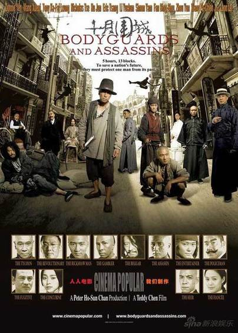
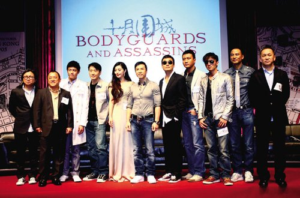

《十月围城》

			【夫妻影评】《十月围城》

老公的评论：

　　我是很少批评哪部电影的，但这部，我真的想说点什么，但自己宣扬了那么久，不要光提意见，要提建议，所以，我只能说，这部电影是港片走向没落的最佳代表作。

　　说起来《十月围城》里面云集了不少的大腕演员，甄子丹、谢霆锋、梁家辉、任达华、黎明都是我们非常喜欢的演员，但这部电影看起来，不知道怎么就不是那个味道。

　　或许，是我太傻太天真，修养不够，不理解“一将功成万骨枯”的含义，那个会议，无论如何不能在别的国家开，就要去挑战一下又多少人会流血牺牲……

　　真的是一种说不出来的感觉，我不大喜欢看黑色的电影，不知道这样的电影要宣扬什么！

　　亮点，是我看到了巴特尔的演出，作为一名职业篮球运动员，我觉得巴特尔在这部电影里造型和表演都还说的上到位，反正是给我眼前一亮的感觉，我想，巴特尔扮演的这个角色可能会为中国的魔幻作品开一个好头吧——原来我们真的有能扮演古代“黄巾力士”的演员，而且，不用特效。

　　这样的电影，如果再多几部，我想我会放弃合拍的电影，放弃我曾经还算喜欢的陈可辛……
 

老婆的评论：

　　用一般来评论这部电影，我想大部分人是会投赞同票。虽然影片中尽是大牌，但也没让影片整体感觉迈向更精彩的阶段。不管怎么样，已经很久没在一部影片上看见这么多的大牌明星了，我还是挺高兴的看过这部影片，尤其是看见巴特尔那各种东西用灌篮的方式去砸人，很有意思，还有一个场景我很喜欢，当然我觉得我不应该说出来，或者要是换是坏人被人这样比较好，我想这个场景我老公是知道的。

　　在本片这么多的明星中，我尤其喜欢甄子丹，他演的动作片很有自己的风格，够酷够狠，让人看完后感觉很解气，对着坏人就需要他这样的英雄。再一个喜欢谢霆锋，其实我不知道我为什么喜欢他，只觉得他还算个男人，或许还有一些小酷，当然在这部影片中，这些特质都没有显示出来，他只是一个善良而又对主人忠诚的人力车夫。对其他的明星都只是一般一般了。

　　从剧情上来看，这应该是孙文的一次小小行动吧，但结果却陪了这么多人的性命，历史是残忍的。看这部影片时间，颇有感受。革命是需要付出血的代价的。也许这就是这部要表达的深层次的东西吧，让我们都记住……。

　　与同事聊起这部影片，有同事说对陈可辛拍的电影，以后不要再看了。我个人觉得到没那么严重，他还是拍过很有很好看的电影的，偶尔一部半部拍的不好，也无可厚非。

上映年份 2010							
		
http://blog.sina.com.cn/s/blog_52187ba90100guoy.html
