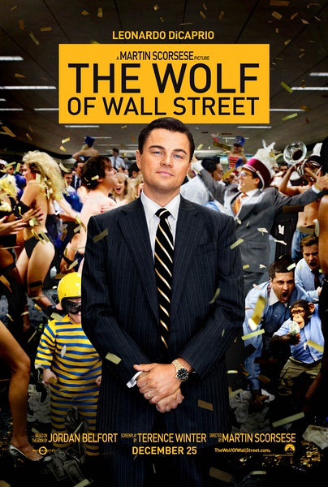

《华尔街之狼 The Wolf of Wall Street》

			

老公的评论：

　　好友墨菲斯向我推荐的这部电影，说拍的不错，其实我是没看出来啦。《华尔街之狼》是一部可看的电影，但是绝对没有好到向朋友推荐的地步，或许墨菲斯最近正在炒股票，或者他比较向往那种纸醉金迷的生活……

　　因为一直不怎么喜欢里奥纳多，所以这部电影到今年才看。另一个没有在第一时间观看这部电影的原因，则是因为我个人并并不怎么喜欢传记类的文艺作品，除了历史题材的，因为历史题材我是当历史看，而没有当传记看。

　　电影中讲述了美国在八十年代理财的骗局，我觉得还是挺真实，而且是有可能实现的，这种骗局和目前我们生活中的很多理财骗局并没有本质的区别——如果你投资的项目赚钱了，那么它就不是骗局。这种事情一直存在，只是人们都一直看不到，或者看到了也不相信它是骗局吧。

　　我没有攻击或者看不起暴发户的意思，但是片中的主人公把暴发户的负面演绎的淋漓尽致……，这方面可以算是有点喜剧色彩吧。

　　我其实不是很理解，难道有钱人就要吸毒、淫乱、违法？还是像主人公这样的人年轻的时候太老实，经历的太少，所以有钱了才去尝试……，所以，我认为在年轻的时候应该多一些经历，哪怕是错误，也错得起……

　　三个小时的电影，看不看自己掂量着办吧，哈哈！

老婆的评论：

　　得先抱怨一下，这个电影的时间真长。

　　还需要说一下，如果是为了励志，里面的性、毒品和混乱的场面真是太多了，也许是为了保留真实的经历，所以把主人公的这段人生展现出来了。

　　这是一部由自传改编的电影，主人公乔丹是华尔街股票经纪人，非常的厉害，语言极有感染力，是一个非常有天赋的销售人才，短短几年就从一个最低层的经纪做到有自己的公司。他们的生活太糜烂了，感觉乔丹真正清醒的时候真不太多，可就这样，生意越做越大，操纵股票和黑色交易让他们赚到钱了，也同时FBI都盯上他了，最终，他被关了3年，出来后的职业真适合他，演讲师。

　　我记得里面的一段，关于卖钢笔，乔丹问他的朋友如何推销这支钢笔，朋友说请给我签个名，自然而然的就把钢笔推销给乔丹了——需求。

　　莱昂纳多·迪卡普里奥演的不错。

没想到，他是《星际穿越》的主演——马修·麦康纳

右是乔纳·希尔，看过他主演《龙虎少年队》。
上映年份 2013
							
		
http://blog.sina.com.cn/s/blog_52187ba90102vpu3.html
