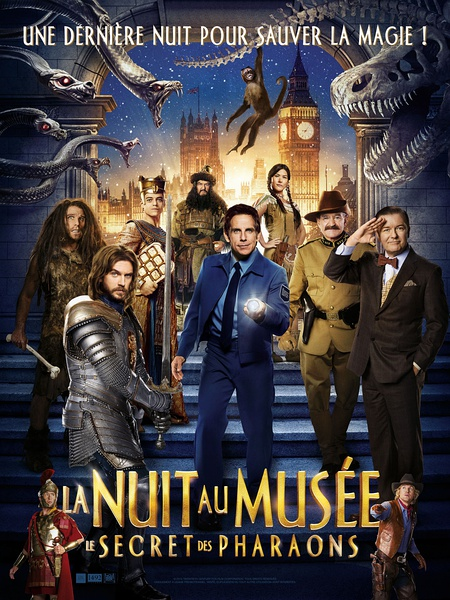
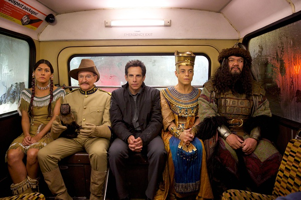
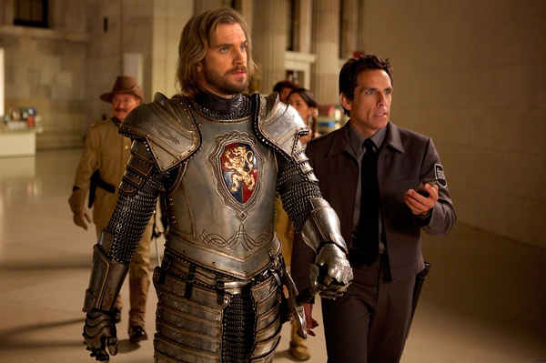
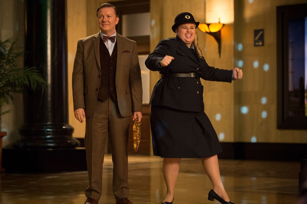

《博物馆奇妙夜3 Night at the Museum3》

			

老公的评论：

　　其实我还是很喜欢本·斯蒂勒的，现在虽然他有些老态了，但是对于他之前的喜剧片中的形象与效果，还是觉得很到位，很喜剧，用这部电影中“兰斯洛特”的话说，就是“很埃瑞克”！

　　看这个系列的电影，我总是觉得和看《侏罗纪公园》差不多，看的就是特效和视觉冲击，我觉得电影中这些部分虽然做的还不错，但是还不够。比如那个猎户星座射真人头顶苹果的桥段，真的很棒，我在想，如果真是有一家这样的餐厅，那么估计可以超越美国或者澳门的任何一家顶级秀场了。说老实话，想开一家这种以3D效果为主题的餐厅，禁止用手机，但是可以把特效拍成视频送给客户。

　　除了我觉得特效还不够之外，电影中的一些关于青少年教育方面的话题也拉低了整体效率，莱瑞的儿子根本没必要出现在电影之中了。另外兰斯洛特对上休·杰克曼也与电影的主题无关，这些小细节说明了这部电影还有提升的空间，还有第四部的可能，至少在我看来是这样。

　　《博物馆奇妙夜》系列打造的是一个魔法世界，是真正的成人童话，至少我是很向往的，如果能亲身经历这些，我会觉得够刺激。

　　最后，有个问题我忘记在之前两部有没有解释了，就是被怪物们撞坏的建筑，比如墙啊，门啊，是怎么恢复的，哪位能给解释一下啊？

老婆的评论：

　　刚开始的时候忘了博物馆那些动起来的动物和人是因为黄金罗盘，这个让老公觉得系列电影应该攒在一起看，缺点就是等的时间太长，要是有时代特色的话，就会少点感觉了。

　　这次为了有点变化，从美国博物馆跑到了英国博物馆，增加了新角色，兰斯洛特、中国的九头蛇相柳和埃及法老。甚至为女保安和野人安排了一场爱情故事，看着他们互相听不懂还在交流，很逗！

　　黄金罗盘因为没有吸收到月亮，导致法力越来越低，将要带来死亡了，其实我不知道那个死亡包不包括活着的人类？那些因为它而动起来的动物和人将要回到原本的状态，对于他们来说是不是也是一种死亡？

　　最后结局多好，大家一起玩，多快乐！　　

新角色-圆桌骑士兰斯诺特

上映年份 2015							
		
http://blog.sina.com.cn/s/blog_52187ba90102voly.html
