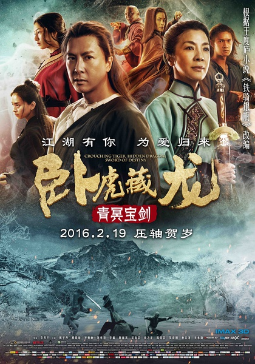
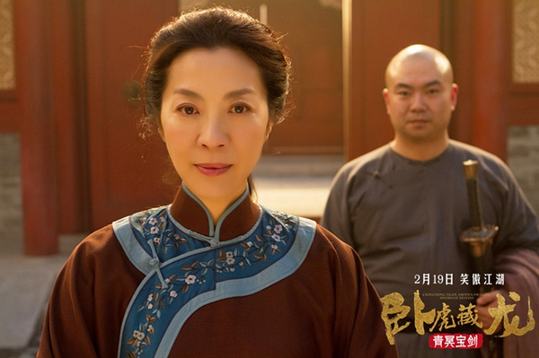

《卧虎藏龙：青冥宝剑》

			

老公的评论：

　　颜值很低的一部电影，包括四名主演，老的老，嫩的嫩，在看过演员介绍之后发现居然大部分都是外国人，这下放心了，让这些“歪瓜咧枣”们都去替我们开疆辟土吧，哈哈！

　　整部电影都带着一种淡淡的味道：淡淡的中国文化气息，淡淡的哀伤，淡淡的玩笑……，这种风格本不适合出现在功夫片之中，但是出现了，配合的还不错。

　　杨紫琼真的老了，甄子丹怎么胖了？好在这部电影并非青春偶像型的，片子的内容很怀旧，所以，老一点也还合适。

　　片中最后的部分我没看懂：既然魏方是要以献剑的名义去刺杀戴阎王，那么为什么不能约上孟思昭俞秀莲一起呢？反正他们最后也要赶来，反正魏方也打不过戴阎王，为什么要让自己的师父死在孟思昭手里呢？杀师之仇可以不报吗？这部的情节安排的很奇怪，让我看的既不知道导演要表现什么，也无法理解角色的心理状况。不过好在是动作片，打吧，看热闹！

　　最后，雪瓶死了没有？很奇怪的一个结尾。青冥剑传说不是孙权的佩剑吗？怎么不把这段历史加上，也许就会多了一些看点呢……

老婆的评论：

　　整部电影给我的感觉都是淡淡的，打斗的方式相对来说也比较朴实，我有点遗憾甑子丹在这部电影特点不不太明显，可能第一要塑造的主人公形象是杨紫琼演绎的俞秀莲。另外，整部电影的色彩也显得有点暗。

　　我感慨电影中孤狼孟思昭（甄子丹饰）这一角色的深情，为了成全定亲的俞秀莲和李慕白在一起，居然想到假死脱身，当然，也气愤他的不诚实，可能蹉跎了他和俞秀莲的半辈子。

　　剧情上的冲突，我以为这部电影刻画的还是比较简洁，正义一方以铁贝勒府为首的要守护青冥宝剑，而邪恶一方是江湖邪派戴阎王要争夺宝剑来统领江湖。

　　牺牲了不少人的情况下，正义方保护了青冥宝剑。正在上帝的视角上，有的时候，我看着电影里的人物正在做一些无谓的牺牲，真让我觉得无力。

上映年份：2016							
		
http://blog.sina.com.cn/s/blog_52187ba90102x16u.html
