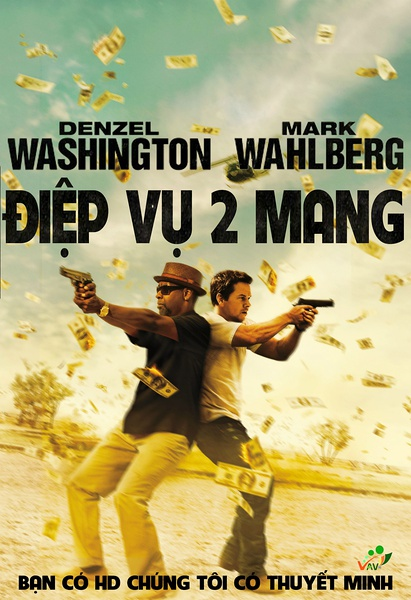
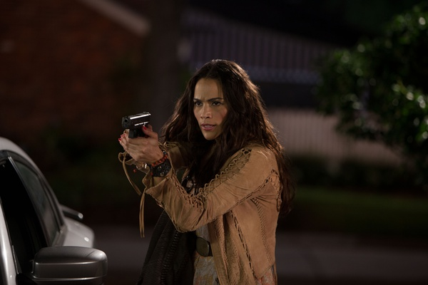
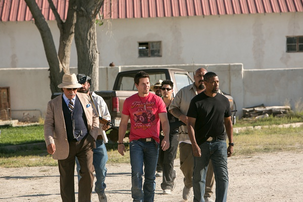
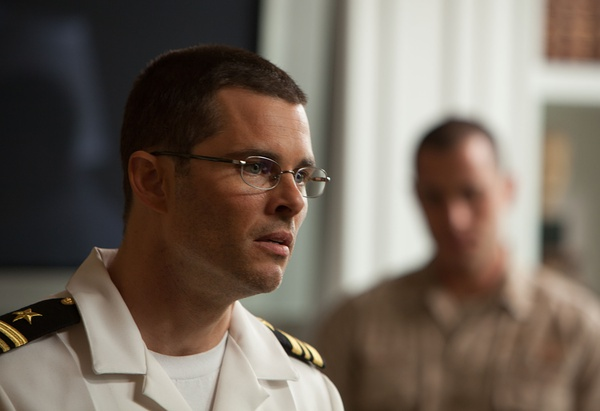

《双龙出击 2 Guns》

			

老公的评论：

　　沃尔伯格和华盛顿都是我们喜欢的动作片演员，这部电影在激烈的枪战之余还有一些“正义英雄”挑战“邪恶力量”的感觉，另外笑点也恰到好处。

　　在以前的一些文艺作品中已经看过了“CIA通过和贩毒组织合作赚取经费”的概念，这部电影中又提到了这一点，并且还把CIA追款的官员描述的像个暴力的坏蛋，挺有意思的。

　　影片的最后有三点让我觉得这个电影大有前景，要是拍成一部系列剧应该很有意思：两位主人公又盯上了CIA另一个存钱的“金库”，这一下子让我们对未来的剧情多了很多幻想的空间——也许他们两个最后就发展成挑战CIA邪恶一面的英雄了；第二个点则是之前的四千多万美元并没有全部被炸掉，两个人有了足够的活动经费可以装备自己，发展自己的力量；第三个看点已经提到了，就是希望能够看到这样一部美剧，估计很棒。

　　对比《伸冤人》感觉华盛顿年轻了一些，差几年就差这么多吗？

老婆的评论：

　　怎么现在很流行老人家当主演吗？又一部丹泽尔华盛顿主演的电影，节奏快，情节简单，人物性格有仇必报，两主角都很强，是部好看的电影。

　　斯汀（马克·沃尔伯格 Mark Wahlberg 饰）和鲍比（丹泽尔·华盛顿 Denzel Washington
饰）这两个卧底也真够倒霉的，斯汀是被上级利用的倒霉孩子，鲍比和他的组织或是和他的女友到底是怎么回事？也够闹心的。

　　他们俩要去抢毒品犯的300万，没明白怎么回事这钱变成4000多万而且是FBI的，斯汀把鲍比打到，钱给了上司，因为放了鲍比，反要被上司追杀，FBI也在追查谁抢了他们的钱，鲍比也在找他，后来黑帮也出现了，反正是惹了马蜂窝，很是混乱。

　　这两人都是神枪手额，多厉害，把这些人一次给解决了，当然鲍比还是需要还斯汀一枪的。

　　到底鲍比藏了多少钱？这下斯汀有的想了。而他们又开始盯着下一个FBI钱点了，哈哈，观众们有的想了。

把马克沃尔伯格看成马克达蒙了

没想明白，他图的是什么？
上映年份 2013							
		
http://blog.sina.com.cn/s/blog_52187ba90102vg0l.html
