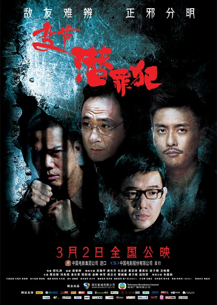

《变节2：潜罪犯》

			

老公的评论：
 

　　现在，每当看到一部好看的香港电影或者电视剧的时候，总是会担心结尾很糟糕，真的，这种感觉只有看到好看的文艺作品的时候才有，真的很怕一件艺术品就这么被毁了，而这部《变节2：潜罪犯》让我的担心变成了现实。
 

　　喜欢香港的电视剧，所以对邵氏的电影总是很有感情的，更不用说“Laughing哥”还是那么成功的一个角色，本片之中，一直到大切挖出自己的肾脏之前，都是很有悬念的，很不错，甚至是在结尾之前都是很不错的，只是结尾结的很唐突。
 
　　用老婆大人的话说，估计是不想拍下一部有Laughing哥的戏了，所以把他写死，可能只有这种看法是合理的吧。
 

　　吴镇宇是一个很有特点的演员，而他所饰演的角色的感觉，想不变态都不行，心理医生，特别是有点偏执、扭曲的心理医生是在是太适合他的角色了，估计这部戏要是电视剧的话，他可以把这个角色诠释的更好。
 
　　故事的结尾虽然让人不爽，但是也留下了一悬念——香港的三万多警察真的会被那样一个人统领吗？

老婆的评论：
 
　　结局把这部电影给糟蹋了。
 

　　我很是遗憾，在我想来，有好几种结尾可设计，偏偏就来了这样一种，很奇怪。设计心理学教授有精神病不好，设计最后黑警一哥没事也不好，设计Laughing这么死也很奇怪，设计教授被姚可可杀了也粗糙而姚可可神经病是更不可取得。
 
　　其实电影的开头还是很不错的，一个心理学家，一个警察卧底，在监狱里开展的不错，调查黑警。
 
　　谢天华演的不错。
　
上映年份　2012							
		
http://blog.sina.com.cn/s/blog_52187ba90101eovb.html
