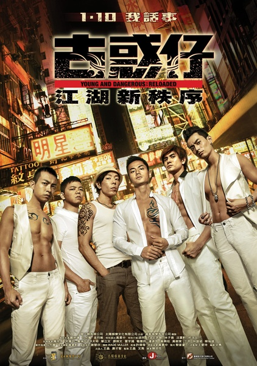
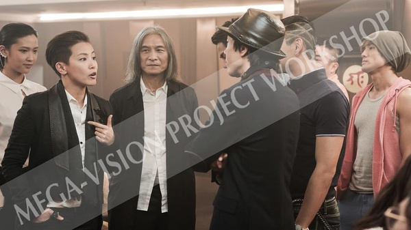

《古惑仔：江湖新秩序》

			

老公的评论：
　　看这部电影，不光是因为对《古惑仔》的怀念，TVB的这些演员也是我们熟悉和喜爱的。
 

　　认识罗仲谦和梁烈唯是因为《尖子攻略》；而认识沈震轩是因为《潜行狙击》，到现在我们还叫他“爆灯”；林子善在TVB的剧集中也有不少角色，喜欢看TVB剧的我们也想看看《古惑仔：江湖新秩序》就很自然了。
 

　　坦白讲，如果以“古惑仔”的标准来衡量，这部新电影显然是比不上前辈们的旧作的。陈浩南、山鸡正两个角色就像是为郑伊健和陈小春两个人量身定做的，或者说他们两个能够成为演员的宿命就是扮演这两个角色，这是天生的，别人怎么也达不到同样的高度。与之类似的还有郑少秋版的楚留香、梁朝伟版的韦小宝等等。
 
　　如果不硬做比较的话，我觉得新版古惑仔还是可看的，当然，除了里面的一些裸露镜头以及很多粗口之外。
 

　　罗仲谦正的部分够了，酷也有一些，但是少了点的霸气；梁烈唯够贱，够色，但是少了一分彪悍凶狠，这是一些缺憾，但也是他们对角色的新的诠释吧。
 
　　黄贯中演的B哥有型，但是有点像黄渤，这样就不单有型，还有点搞笑了。
 

　　最后说说沈震轩，其实我觉得他还是很帅气的，不过好像香港的帅哥总是演不了好角色，或者说是演不了太多的好角色，看着他饰演的变态，我们就想起了慢慢沉沦的关礼杰，呵呵。
 
　　这部电影还留了很多的伏笔，应该会有续集吧。

老婆的评论：
 

　　这部电影对于我来说是看个热闹，老版古惑仔的系列电影我都看过了，并且非常的喜欢，在某种意义上，我觉得再怎么拍也不能有超越。
 

　　这是一群熟悉的演员，梁烈唯、罗仲谦和林子善都是我们喜欢的演员，所以这部电影虽说不没有之前的古惑仔有感觉，但看的时候也挺高兴的。
 
　　很佩服牧师的牺牲精神，很欣赏浩南的义气，这就是这部电影给我的感触吧。
 
上映年份　2013							
		
http://blog.sina.com.cn/s/blog_52187ba90101e02z.html
