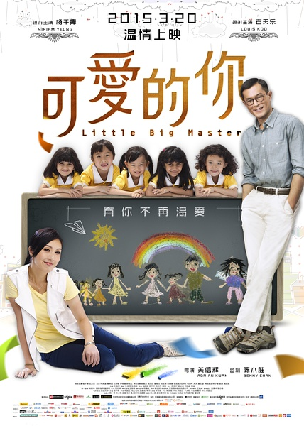
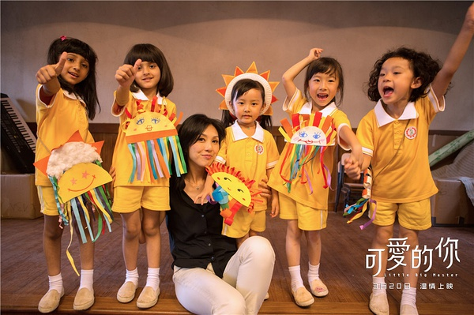
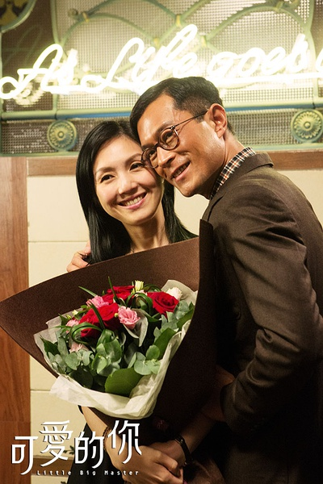

《可爱的你》

			

老公的评论：

　　每次和老婆大人一起看那种以感动人为目的的电影的时候我总是很有些“无助”，我实在是不明白老婆大人为什么会陪着主人公一起流泪……，那不是电影吗？

　　我一直不喜欢那些用眼泪来打动观众的电影，我觉得用悲剧来博得观众的同情总是落了下乘，其实，好的喜剧同样可以很感人。

　　对于这部电影，我首先想说的是吴耀汉和冯淬帆，我不知道我的朋友之中有多少人能够叫出这两位老人家的名字，但是看他们再度出现在屏幕上，真的很“情怀”。吴耀汉已经快八十岁的高龄还要饰演一个学龄前小朋友的父亲，太有意思了。怀念他们“五福星”的年代，怀念那个年代单纯的开心与快乐。

　　我虽然没有那么容易被感动，但是这个故事却真的让我看到了人性中“善”的一面，只是我不懂古天乐饰演的那个男主人公为什么对那个断头台那么热衷，不顾老婆生病也要把断头台运到医院外面……，什么意思？

　　我在想，如果是我呢？我会不会愿意去帮助无辜的小朋友？我想我可能会接受那份高薪的工作，然后再资助那五个孩子，或者，让森美扮演的那个角色接受“安排接收五个孩子”的条件，这多好？

　　这个电影让我记住的一句话是“教育是用生命影响生命”，真的不错，经典！

老婆的评论：

　　诶，香港还有这么穷的地方。

　　这部电影的熟脸孔还挺多的。

　　整部电影挺温馨的，吕慧红（杨千嬅饰）多让人感动，为了这几个孩子，去那里当校长，薪水多低而且身体还不好。

　　其实在我看来吕慧红和丈夫谢永东（古天乐饰）一样都是工作狂，感觉上还挺有原则的。

　　我觉得本片最应该学习的是吕慧红那种教育孩子的方式——用生命影响生命，其实应该多演演，让我学习一下。

　　至于那几个孩子没什么好说的。

上映年份 2015							
		
http://blog.sina.com.cn/s/blog_52187ba90102wrss.html
