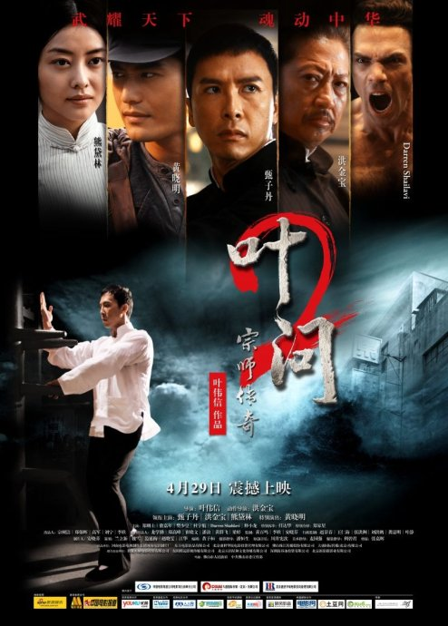
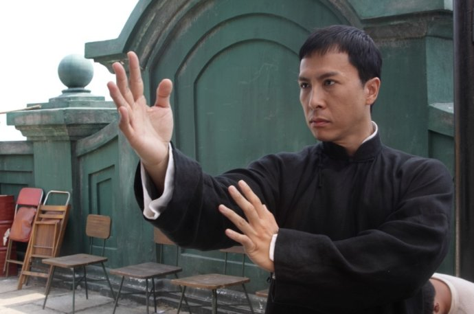

《叶问2》

			【夫妻影评】《叶问2》

老公的评论：
 
　　自从看了电影《叶问》之后，就一直等待着续集，关注它的新闻也关注了很久，今天终于得偿所愿，开心！
 

　　甄子丹演的叶问，和他一贯走的暴力式武打不一样——我指的是《导火线》那种感觉，不过甄子丹的外表，加上那传统的中式大褂儿，感觉真的很儒雅。很他扮演的角色在电影中所说的一样，他练的不是武术，而是中国文化。
 

　　因为有了异常出彩的第一部，所以很多电影的续集都很不好拍，《叶问》也是一样，剧情安排虽然很紧凑，但总比期待中的完美要差一些。
 

　　在看电影的时候，老婆大人说甄子丹扮演的叶问真的很淡定，我也深深觉得如此，叶问这个角色，真的是很好地诠释了淡定这个概念。
 

　　看了《叶问2》，又看了《精武风云》，觉得港片还是拍功夫片更好看一些，看着那一个个熟悉的角色，樊少皇、洪金宝、任达华、敖佳年、罗莽……，真的希望港片能够再度辉煌起来！
 

老婆的评论：
 

　　当中国功夫遇到西洋拳，你认为谁会赢？我们的民族英雄又是如何把嚣张的老外打到服呢？这样的剧情你是不是觉得很熟悉？这种场景这种感觉，我有个好几次了。那这样的故事是不是有点落入了俗套？是不是就不好看了呢？我个人觉得，这部影片还是挺好看的。
 

　　我喜欢如此淡定的叶问，也喜欢把这个人物演出彩的甄子丹。不过，我觉得中国人总是太谦逊了，有的时候也应该嚣张点，老被各种人欺负，看着这些总是让人很压抑。
 
　　我要是编剧的话，我可没那么高超的情节，我一定派一堆人上去把这个叫嚣的老外踩他个满地找牙，也要为死去的洪师傅报上一仇。
 

　　至于电影中，叶问徒弟什么的，武术界的帮会，一切的一切都是为了引出这场振奋人心的对决，毫无疑问，赢是必然的，赢的那么曲折那么艰难，也只不过是让观众紧张紧张而已。
 
上映年份
2010							
		
http://blog.sina.com.cn/s/blog_52187ba90100orvx.html
