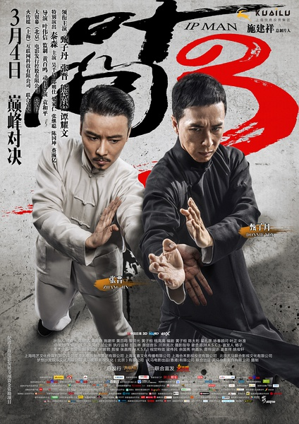
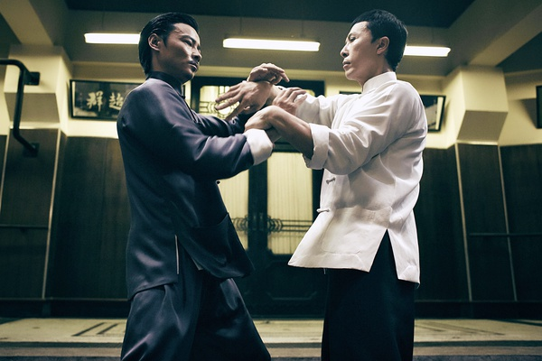
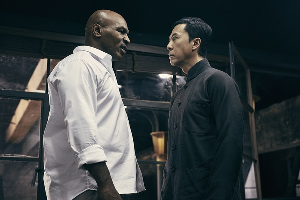

《叶问3》

			

老公的评论：

　　看甄子丹演的叶问，总有一种想要模仿的冲动，模仿片中叶问的那种淡定，太平和了，特别是当叶夫人生病，叶问看到报纸上的挑战书时的平和与不在意，真的是只有中国武人才有的风范。

　　在这一部电影中，少了那些政治题材，而让武侠回归于“除暴安良”，我觉得还是简单点好，太多涉及政治、历史的内容容易让导演、编剧的发挥受到限制，就在民间打打挺好。

　　张晋最近是越来越红了，他的扮相和身段也确实不错。故事中的张天志有一点可怜，明明在救小朋友的故事里他才是保护小朋友的主力，可是却被误会成了罪犯，这也难怪他后来很气不忿吧！

　　张继聪演了一个愣头青，和他在TVB剧集中扮演的有智慧的形象有点差距。泰森在这部电影中到底要表现什么？有点莫名其妙，反倒是饰演他手下的谭耀文演的真不错！另外，梁家仁真的老了……

　　很好看的系列电影，但是从内容题材方面来看，恐怕不会有下一部了……，最难得的是这三部电影都保持了比较高的水准，并没有因为续拍而让人觉得无味！

老婆的评论：

　　我很喜欢这部电影，在我看来，甄子丹把叶问这个角色饰演的太成功了，这个叶问，真是从容和淡定。就目前看，在电影的角色，我还从没这样觉得那个角色会这么让人难以忘记。

　　这一部，叶问除了功夫上的表现，在亲情上也得到了考验，他的妻子张永成（熊黛林饰）忽然得病了，他陪伴妻子走完最后的那段时间，在和张天志（张晋饰）比武后，也表达其实最重要的事情是身边的亲人。

　　在和马鲸笙（谭耀文饰）的较量中，他和张天志两人，对付着那么一大批人，也真是威武，可怜的张天志，救了这么多小朋友，最后相片中都没有他。

　　最后叶问直接找到马鲸笙的老板（迈克.泰森 饰），这场拳击和武术的较量，还是挺有意思的。

　　额，还要说一下，其实张晋的演功夫戏真不错，感觉上有力量。

上映年份　2015
							
		
http://blog.sina.com.cn/s/blog_52187ba90102wfv7.html
