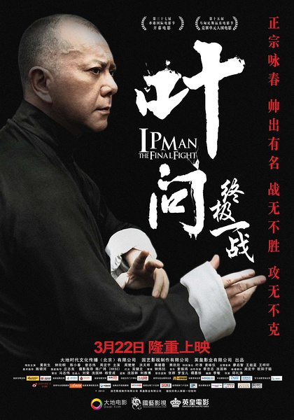
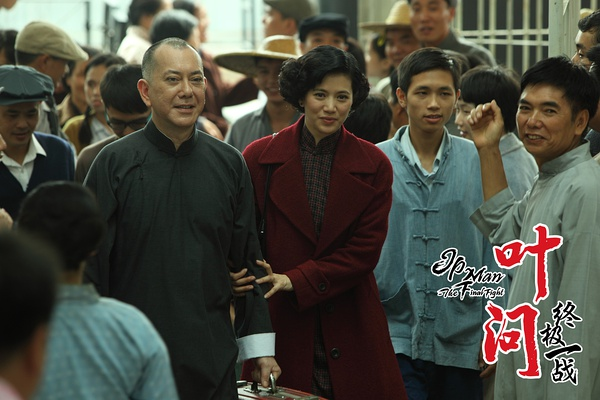
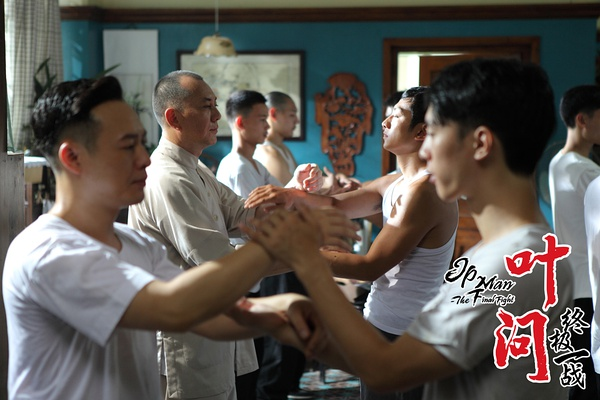

《叶问之终极一战》

			

老公的评论：

　　因为黄秋生演叶问，我是抱着姑且一试的心情看这部电影的，没想到越看越觉得精彩，用一句吴镇宇的话来描述黄秋生：“太演技派了”！
 

　　电影中的叶问表现出了一份超然的淡定，同时又有武人的霸气，黄秋生把这两点表演的都入木三分，不同于其他演员；陈小春演的警察好像又回到了我最早对他的印象（不是古惑仔，电影的名字我忘了，他演一个警察，很倔强）；洪天明在《笑功震武林》之后又出现了一次，地位有所提高，演大师兄了，他现在好像是王晶电影的重要配角；蒋璐霞算不上好看，但是最近她扮演的角色也逐渐多了起来，对了，还要再提一下卢惠光，好久没见他了；钟欣桐看来依旧年轻，化妆的力量着实可怕。
 

　　曾志伟和黄秋生在片中的那段打斗挺好看的，熊欣欣和黄秋生的那段也很棒，不同于甄子丹，但是现在的特效加上演员的演技让一切都变得好看了。
 
　　片子快结束的时候怎么好像是在说“叶问”并不喜欢“李小龙”？虽然没有点名，但总是这个意思吧，挺奇怪的。
 
　　刚在港剧《情逆三世缘》里看到了有关“九龙城寨”的故事，这部电影里就又提到了，可以算是历史课的一部分了吧。

老婆的评论：
 

　　最近都不怎么看电影了，没想到黄秋生把叶问演的也挺有味道的，之前的叶问是甑子丹演的，我还怀疑黄秋生会把叶问演成什么样呢，没让我失望。
 

　　真不知道是甑子丹演的叶问导致永春火了叶问跟着火了，还是李小龙导致永春火了，听老公说还有梁朝伟版的叶问，那应该也好看吧。
 

　　这部电影的某些片段和我们前段时间看的《情逆三世缘》有相同之处，也正因为看了《情逆三世缘》，所以这部电影的九龙城这桥段理解的更透彻。
 
　　总的来说值得一看。

上映年份　2013							
		
http://blog.sina.com.cn/s/blog_52187ba90101e024.html
