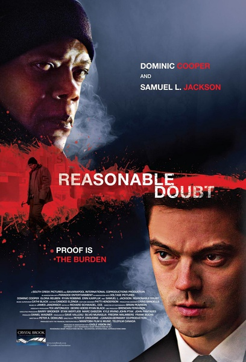

《合理怀疑 Reasonable Doubt》

			

老公的评论：

　　故事的开始很精彩，一下子就抓住了我的神经，让我去思考年轻的律师到底如何去面对良心的不安以及如何抵御对家庭的威胁；故事的中段儿也很精彩，一直到主人公的弟弟被抓住，主人公遭到终极陷害，本来期待看律师是如何通过智慧解除危机的，谁想到结尾如此突兀，突兀的让我感觉是在看另一部影片。

　　我的意思是，好像是两部电影被拼在了一起，一部好看的电影的百分之九十，加上一部难看的电影的百分之十，我相信看过的人都会觉得这个结尾挺郁闷的，应该说，这部电影是虎头结尾的经典代表。

　　在电影的最后几秒钟，主人公原谅了他没有血缘的弟弟，似乎是想表示家庭的温暖，歌颂一些正能量的东西，但是在之前为什么要把塞缪尔·杰克逊扮演的“杀手”描述成一个是非不分的狂人呢？

　　因为自己的家庭受到了伤害，转而去对付那些伤害别人家庭的人，这种地下法官的题材很多，大部分也都很解气，但是为什么这部电影中的“地下法官”最后要去伤害别人的家庭呢？这个反转也太愣了吧……

　　实话实说，在结尾之前，悬疑感真的制造出来了，别的，就不说了……

老婆的评论：

　　犯错和撒谎一样，通常我们为了掩盖一个错误或者一个谎言，就会犯更多的错误和撒更多的谎。

　　本片的主人公检察官犯了一个错误，那就是酒后驾车，因为喝了酒开车，所以撞到人后打了急救电话跑了，后来得知被撞的人死了，而另外一个人被怀疑成杀人犯，我觉得他有点像做贼心虚，忍不住就会关注这个案子。

　　他一点点发现事情不是这样，他怀疑被释放的犯人是真正的杀人犯，而且还是连环杀手，他拖着他兄弟来调查此事，反而被陷害成凶杀，还把他的妻子和孩子带入了困境。

　　最后，凶手是死了，他和他兄弟也没事。

　　整个剧情还是不错的，一个错误带出了这么多问题，剧情紧凑，故事发展的也很合理，从这个故事里，让我们明白，尽量少犯错，心理问题一定要被重视。

上映年份 2014
							
		
http://blog.sina.com.cn/s/blog_52187ba90102vqj1.html
