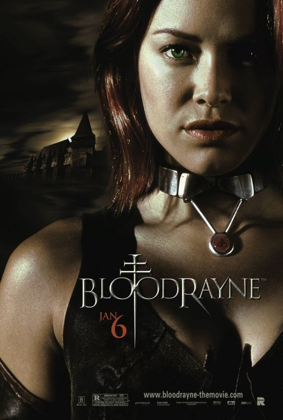

《吸血莱恩 Blood Rayne 1＋2》

			【夫妻影评】《吸血莱恩 Blood Rayne 1＋2》

老公的评论：
 

　　因为喜欢吸血鬼题材的文艺作品，所以找了《吸血莱恩》来看，因为不怎么玩游戏，所以不知道原来这两部电影都是根据游戏改编的。
 
　　不知道玩过同名游戏的人怎么看待这两部电影，从我的角度来看，第一部有些简单，第二部虽然场景单一，但结构更紧凑。
 

　　一部动作戏，剧情没有什么好评论，但对比其他的吸血鬼题材的电影或电视剧，我觉得《吸血莱恩》给我带来了如下关于吸血鬼的诠释：
 
　　一　强调了半人半吸血鬼的概念；
　　二　吸血鬼不一定要喝人血，动物的血液一样可以供他们引用，这一点在《暮色》里也有同样的说法；
　　三　吸血鬼可以吸其他吸血鬼的血，这一点在别的电影中表现的很少；
　　四　吸血鬼并非不死之身，他们只有依靠吸血才能给自己“补血”，这一点等于对吸血鬼这种生物给出了一个新的概念。
　　五　吸血鬼咬过的人会变成吸血鬼，除非他们的喉咙被咬断。
 

　　我很喜欢吸血鬼的题材，也准备写这方面的小说，希望在我动笔之前，从外界获得的知识越多越好，这样我才可以杂取种种吸血鬼，合成一个吸血鬼……
 

 
老婆的评论：
 

　　半人半吸血鬼是一个传奇，在我所接触过的吸血鬼中，只有莱恩和《暮色》爱德华与贝拉的女儿蕾妮斯梅，这被认为是异形中的异形，在无数人看来是绝不可能的。
 

　　没想到吸血鬼莱恩第一部和第二部不是一个主演演的，而第二部也没有交代莱恩变样子的事情，所以，怎么都感觉这两部影片的关联性不大。这两部电影，相比之下更喜欢第一部，莱恩性格塑造的更完整，人物形象更酷！
 
　　很喜欢看吸血鬼的故事，幻想过和老公变成吸血鬼之后，能做多少事情，去多少个地方呆着，也许就能成为最大的地主呢。呵呵！
 

　　关于这两部影片，虽然我和喜欢吸血鬼的故事，第一部值得看一下，有点血腥，第二部我只能用一般来形容了，这换成一般的人也没有问题，决斗呗，这部电影并没有因为吸血鬼而出彩，这就失去了吸血鬼的意义了，但我为第二部死的两勇士而遗憾，真的很可惜。
 
导演乌维.鲍尔

主要演员第一部
莱恩……克里斯塔娜·罗肯
第二部
莱恩……娜塔莎·迈尔兹

上映时间
吸血莱恩 2005
吸血莱恩2：解放 2007
 
 
欢迎加入我们的科幻俱乐部 <a href="http://tieba.baidu.com/club/10570395">http://tieba.baidu.com/club/10570395</a>，希望我们能够一起科幻！							
		
http://blog.sina.com.cn/s/blog_52187ba90100nq90.html
