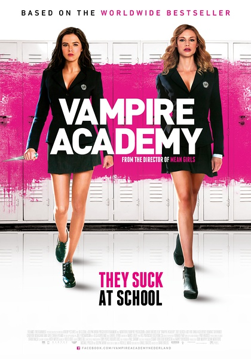
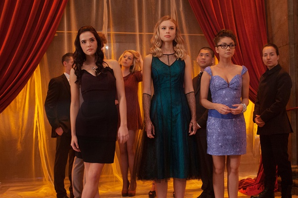
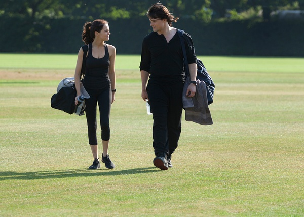

《吸血鬼学院：嗜血姐妹　Vampire Academy: Blood Sisters》

			

老公的评论：

　　先要不满一下翻译，吸血鬼学院翻译的没什么问题，但是Blood
Sisters，在这里怎么能翻译成嗜血姐妹呢？某在线翻译直接翻译成“亲姐妹”——我觉得这个翻译都比“嗜血姐妹”要好，从整部电影来看，虽然是吸血鬼题材，但是并没有把“嗜血”当成一个重点，而且情同姐妹的两个女主角其中一个完全不吸血，唉，真不知道这个翻译为什么这么不负责任。

　　呵呵，不过不用纠结名字的问题，电影好看就行了。

　　我们两个一直喜欢灵异题材的影视，其中吸血鬼恐怕是老婆大人的最爱了，这主要的原因大概是影视作品中的男吸血鬼都长得很帅。

　　《吸血鬼学院》和以往很多同题材的电影不同，里面讲的是吸血鬼种族中又分为三个族群，而且这三个族群之间又有着关联和斗争，这个概念还是挺有突破性的。

　　在我的记忆中，吸血鬼要么是和人类谈恋爱，要么是和狼人战斗，要么是被吸血鬼猎人屠杀，总是逃不开这三个命运的，但是这次确实不一样了。影片最后显示的场景暗示着大批的传统吸血鬼要进攻吸血鬼学院了，这点挺让我哦期待下一部的。

　　电影中的恋爱情结也挺有趣，其中有句台词让我很欣赏“你不爱我的理由恰恰让我更爱你了……”，多有趣的话题。

　　女主角长得很有个性，但是这部片子在我看来，遗憾的地方在于男主角还不够酷帅，太过于朴实了。

　　并没有太多的血腥恐怖镜头，喜欢言情的朋友也很适合观看这部电影，推荐！

老婆的评论：

　　原来吸血鬼分种类的，这是第一次我看到在一部电影里，有不同种类的吸血鬼，有不怕阳光拥有魔法的吸血鬼、半人半吸血鬼这个是可以随便吃东西的、有只有晚上才能出来但力量很大的吸血鬼。

　　战争中，直接的正面的对抗，说起来没那么可怕，可以预防，最多只是输了，而那些阴谋是很可怕的，在背后扎一下，会致命，但是，最可怕不是这些，而是你被自己人惦记上了，慢慢的用阴谋一点点的逼你达到目的，就如本片的维克多，为了自己，他算计公主莉莎。

　　是直觉吗？在我看到莉莎会治疗时，我想这个背后的坏人一定是维克多了，因为他有需求，他的女儿我到是没什么想法。

　　这是一部歌颂友谊的影片，莉莎和她的守护人萝斯，互相信任，互相守护，坚定不移。

　　当热了，年轻人还得有自己的爱情故事，萝斯与迪米特里，莉莎与克里斯蒂安。

　　结尾部分，给了无数多黑夜吸血鬼的特写，留下怕下一部的悬念了。

相爱不能在一起

上映年份 2014							
		
http://blog.sina.com.cn/s/blog_52187ba90102vq98.html
