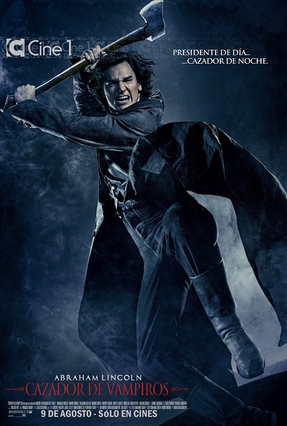
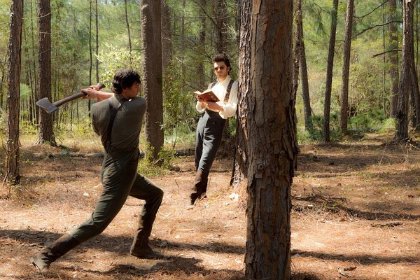
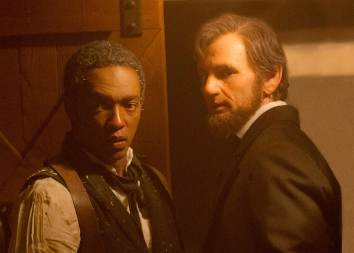

《吸血鬼猎人林肯 Abraham Lincoln: Vampire Hunter》

			

老公的评论：
 
　　在观看之前，没想到这部片子的主人公真的是美国的那个总统，更没有想到这个题材居然和美国建国扯到了一起。
 

　　看这部电影的时候，我的第一个想法是黄帝大战蚩尤——看来虽然美国的编剧们虽然并没有我们的历史，却幻想着可以有一个和我们一样神话般的祖先。
 

　　没想到美国电影居然恶搞自己的开国元勋，这个显得很古怪，林肯真的是个吸血鬼猎人吗？在解放黑奴的战斗中，吸血鬼参战了吗？有人会以为这是历史吗？
 
　　显然这些都不重要，重要的是这部电影很有趣。
 

　　好看的场景之一来自于林肯在马群中和巴兹的大战，这样的场景在吸血鬼猎人的片子里还是独有风味的；另外斯比德的“假背叛”也是一个很“原来如此”的看点；还有的就是这个片子虽然很打，但是并没有那么血腥，这也是很难得的。
 

　　就在我们一边批评着清宫剧、抗战神剧改变着我们的下一代对历史的认知的时候，美国人的电影也在做着同样的事情，真不知道对于看了这部电影的小朋友来说，林肯到底会是一个严肃、高大的政治领袖，还是一个很酷的吸血鬼猎人呢？或者，二者兼是？
 
　　所以，重要的不是那些影视作品里说了什么，而是我们永远不该把文艺作品表现的东西当成真实的世界，这才是正理。

老婆的评论：
 

　　在我看来美国的影视作品简直是百无禁忌，他们的开国总统写成了吸血鬼猎人，那他们的解放战争还多了一个吸血鬼元素，很有创意。
 

　　我很喜欢这部电影，学到了一个新概念，吸血鬼杀不了同类。还有居然有人不愿意当吸血鬼。那在马群里打架的场面不错，总体上很不错。
 

　　少年的林肯因为帮助小伙伴而得罪了吸血鬼导致其母亲的去世，复仇是必须的，在后来他认识了吸血鬼猎人彼得，学习了一套杀吸血鬼的本领，可彼得不允许他因复仇而杀戮，之后他杀了仇人。但激怒了吸血鬼王，可这时的林肯已经从猎人成为了解放战争的领袖了，为此他的儿子又被吸血鬼给杀了。
 
　　林肯说有的吸血鬼是可以相信的。

上映年份 2012							
		
http://blog.sina.com.cn/s/blog_52187ba90101hagw.html
