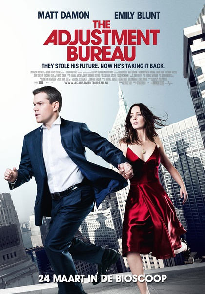

《命运规划局 The Adjustment Bureau》

			

老公的评论：
 
　　这是一部只凭创意就可以卖座的影片。
 
　　设想一下吧，一部本年度的科幻电影，没有异形、没有特效，有的只是一个浪漫的爱情故事，这是怎样的一部电影？
 

　　现在观众的胃口，已经被那些炫目的特技所吊起来了，但特效就是特效，只是辅助影片更好看的工具，终极的好看的文艺作品，还是要通过内容来吸引人的。
 

　　《命运规划局》讲的是一个爱情故事，是一个和命运抗争的爱情故事，看着这个电影，想着自己的生活，我们有多少次顺从了命运，有多少次放弃了自己的抗争？
 

　　这部电影还是要看的，剧透多了就没有意思了，我想说的是这部电影给了我一个关于科幻小说的创意——人类是外星人的试验品，就像我们把一些动物豢养起来一样，外星人把人类放养在地球上，观察着人类这种生物的发展，而人类终究会觉醒，终究会抗争。这个题材是我喜欢的。
 
　　马特·达蒙不演特工了，也还是显得挺有气质的，演政客也很不错，这就是好演员。
 
老婆的评论：
 

　　看电影名字就想这是一部科幻电影，从不知道命运也是规划出来，有人在盯着你不要走出你被规划出来的脚本，错一点就会出来纠正。一杯撞在身上的咖啡，忽然打一个喷嚏都不是意外……，只是觉得制定计划的人很辛苦，这么多的人类。
 

　　这部影片是我们最近看的影片中最有创意的，本片故事情节很简单，以主人公大卫·诺里斯竞选议员失利时，遇到舞蹈演员伊丽丝，产生爱情。但这种相吸并不是命运规划局所愿意看到的，警告诺里斯再安排他们两个遇不上，可是冥冥中，这两个相爱的人又遇到一起了，再来拆散，再威胁，也抵不上两颗相爱的心，诺里斯在哈里的帮助下找到了伊丽丝，命运规划局的“主席”只好给他们一个新的命运。
 

　　那从影片中看到了什么？人是可以抗争命运的，中国古时候就有“人定胜天”的说法，还有两个相爱的人外界是拆散不了，除非他们自己放弃。哦，还想说一下，可怕的命运规划局。
 
上映年份
2011
主演
马特·达蒙
艾米莉·布朗特							
		
http://blog.sina.com.cn/s/blog_52187ba90100vnxd.html
