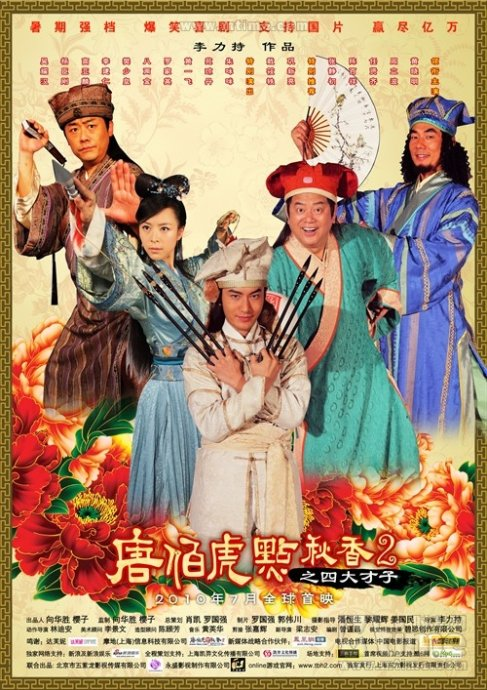

《唐伯虎点秋香2》

			【夫妻影评】《唐伯虎点秋香2》

老公的评论：
 

　　本来因为有周立波，我是不打算看这部电影的，但考虑到毕竟它也是敢叫《唐伯虎点秋香》的，刚好最近看国外的电影又看的有些累了，换换口味吧！
 

　　总的来说，这种电影是没有内涵，也不该有什么内涵的，就是看完要让大家乐一乐，对我们两个人而言，编剧和导演达到目的了，不错！
 

　　故事的最后，脑筋急转弯和樊少皇扮演的角色找到了《葵花宝典》的那两段我很不以为然，现在有很多电影啊，小品啊、相声什么都很偷懒，把一些网上流传了很久的笑话抄过来卖，这未免显得不够精致了。想想梁朝伟、周星驰、张家辉那个时代的喜剧吧！
 
　　另外还有一点，可能是黄晓明还不够无厘头，他扮演的唐伯虎显得精明、正经了一些。张静初扮演的倩倩还不错。
 
　　现在的电影，怎么都流行拍前传，还把前传都叫《ＸＸＸＸ2》，唉……
 

老婆的评论：
 

　　这部影片简直是一部损友记，唐伯虎，祝枝山，文征明，周文宾是好友，但以互相损害对方为乐，反而女主角倩倩即后来的秋香戏淡化了。在看电影的时候老公说，现在电影都流行拍前传的，《唐伯虎点秋香》也应该来部前传，结果这部电影的确没逃过前传的命运。
 

　　此《唐伯虎点秋香2》与《唐伯虎点秋香》给人的感觉差距有点大，记得我看《唐伯虎点秋香》时，把我乐的，而这部2实在是差点意思。当然，也可能与黄晓明这个演员本身有点关系，我觉得他扮酷扮帅都没有问题，扮唐伯虎这样的人，有周星驰与张家辉这样形象的唐伯虎，黄晓明要超越要征服观众，我想也有点难。
 

　　整部影片倒是安排了不少搞笑的镜头，也搞笑，当一部轻松喜剧看也没什么问题，看看乐乐的了，对于我这个看过《四大才子》的人来说，这四个主人公的感觉一点也不像唐伯虎，祝枝山，文征明，周文宾。
 
上映年份
2010							
		
http://blog.sina.com.cn/s/blog_52187ba90100orw3.html
