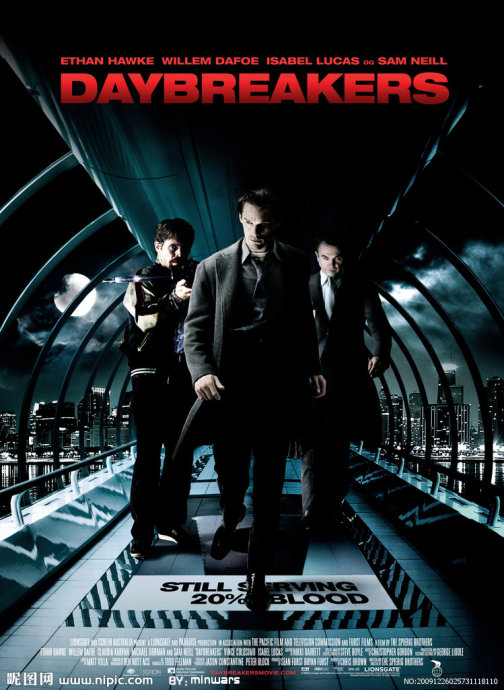

《嗜血破晓 Daybreakers》

			【夫妻影评】《嗜血破晓 Daybreakers》

老公的评论：
 
　　非常好的一部科幻片，逻辑虽然诡异，但是很圆满！
 

　　这是一部有关世界末日的电影，由于某种不可抗力，吸血鬼统治了地球，而人类成为了被猎杀的对象。故事中并没有详细交代吸血鬼是怎么成为地球的主宰的，而是把重点放在了描述吸血鬼社会上。
 

　　电影中也对吸血鬼怕阳光做了另类的解释，紫外线的照射会导致吸血鬼的血液燃烧，而想要把吸血鬼还原成人类，就必须破解血液燃烧的秘密。这也是一部彻底认为吸血鬼可以还原成人类的电影。
 

　　未来社会会是什么样子，估计不是科幻迷得人也会去畅想，区别可能是所想象的时间的远近吧。与地球自然相比，人类是脆弱的，可能不经意的一次什么，就会导致人类完全的改变。这让我想起了非典时期北京的“万人空巷”……
 
　　对于未来的探索可能是有止境的，但对于未来的想象却会永远存在……
 
老婆的评论：
 

　　未来的人类究竟是什么样的？各种版本的都有，就这部电影中，未来的人大部分变成了吸血鬼，我倒是挺能接受的，吸血鬼也是人，他们的基因只是发生了某种突变。
 

　　这部影片看的时候，我总觉得挺残忍的，人类都快没人了，都被吸血鬼吸干了，场面极其的可怕。当看见这些人类被一个个固定在架子上，被抽血。我怎么觉得这些吸血鬼真不会想，他们不把人放出去，多产一些小人，不是更好吗？不然他们哪有血喝。结果人越来越少，血也越来越少，才出现这种吸血鬼疯狂了的场面。
 
　　吸血鬼爱德华·多尔顿他是一个研究替代人血的东西，让吸血鬼不再喝人血了。相对其他的吸血鬼，他比较有人性。
 
　　我喜欢这部电影的一点创意，就是吸血鬼的能变回成人，这太可怕了，想变吸血鬼就变吸血鬼，想变回来就可以变回来。
 
　　这部电影还给我另一个惊奇，就是吸血鬼变成人后的血，是病毒，可以让吸血鬼喝了都变回人。
 
　　我挺喜欢这部电影。
 
上映年份2009
 
导演
Peter Spierig
彼德·斯派瑞格
Michael Spierig
迈克尔·斯派瑞格

主演伊桑·霍克							
		
http://blog.sina.com.cn/s/blog_52187ba90100o2pf.html
