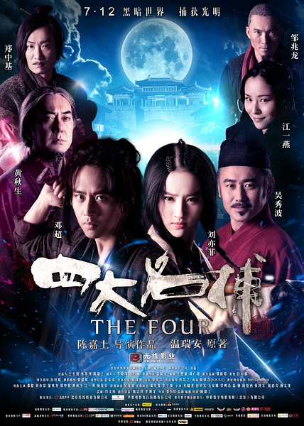
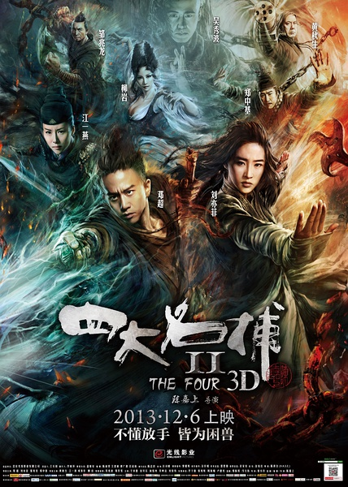
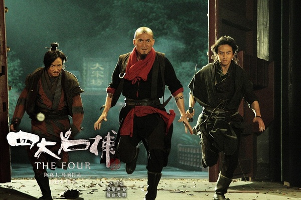
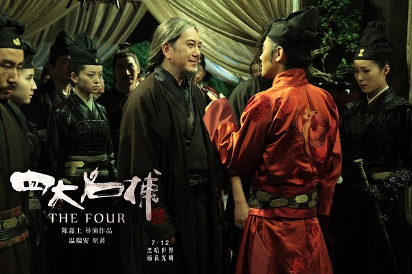

《四大名捕1&2》

			

老公的评论：
 
　　无情是个女人！
 

　　冷血剑快，追命腿凶，铁手拳硬，无情暗器有神功——这是我对四大名捕的印象，之前看过港剧《少年四大名捕》，还算是符合我的认知，但是，在电影中，无情，居然是个女人。
 

　　黄秋生自从演过叶问之后，我对他的印象好了许多，觉得他很适合演那些淡定的大人物，这次他演的诸葛先生，挺不错的，呵呵，就是下巴上的辫子显得嬉皮了一些。
 

　　邹正龙演的铁手还是有点感觉的，但是比小说中的铁手蛮了一些，只是孔武，但并没有书中铁手的慎密的思维；郑中基饰演的追命演出了原著人物戏谑风尘的感觉，但是并没有那种沧桑，冷血确实是被设定成了被狼抚养长大，但是好像不是说变就变狼人吧，嘿！无情——是个女人！
 

　　姬摇花是个不错的名字，书里面也是个女人，这个还算是尊重原著吧。原著里，他和无情确实有对手戏，但是，怎么变成了情敌了呢？难道，就是因为需要三角恋，所以无情变成了女人？
 
　　比起无情的变性来说，我更难接受的是诸葛先生和四大名捕以兄弟相称，这个很颠覆我的感受。
 

　　实话实说，电影挺好看的，但是不应该和原著比较，跳出原著，这两部电影挺不错，挺可看的。算作是温瑞安《四大名捕》的同人作品吧！

老婆的评论：
 

　　大概是因为之前看过港剧翻拍温瑞安的《四大名捕》，对这部电影中的四大名捕角色，我已经有了先入为主的印象，所以很难接受无情是一个女人，更难接受拍二时，用了装备腿可以走了，还安排无情与冷血有感情戏，哈哈！
 
　　如果抛开改编这么一说。
 
　　那么我觉得这两部电影还是可以看的，邓超演的冷血还可以，两部电影的特技安排也不错。
 
　　只是我不喜欢的元素在第二部时又出现了，能变成相同模样的人，这样的编也特简单了吧，案情可以更精彩的。
 
　　我想那第二部还不是最后一部，留了尾巴了，好吧，假如还拍的话，我还会捧场的。　

                               
郑中基、邹振龙、邓超

                                   
黄秋生演的诸葛正我很淡定
上映年份　2013							
		
http://blog.sina.com.cn/s/blog_52187ba90101fuqv.html
