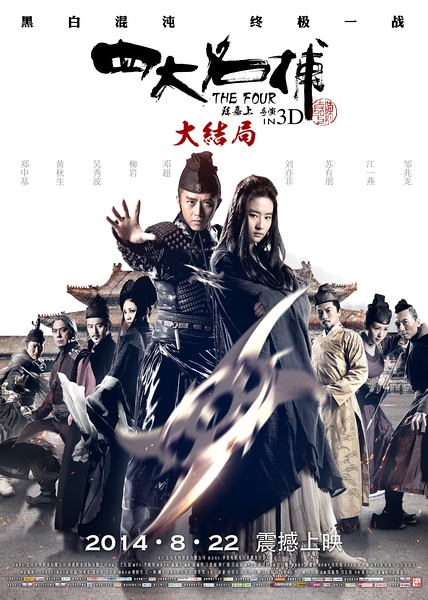
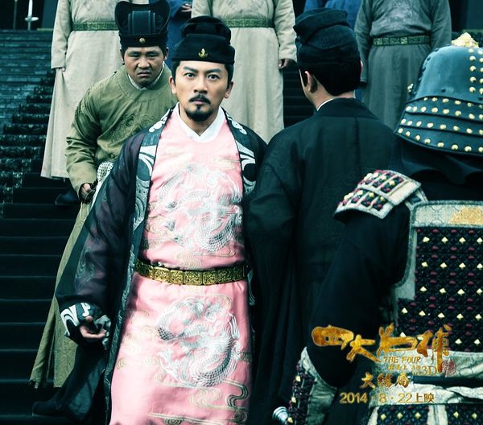

《四大名捕大结局》

			

老公的评论：

　　看过这部电影的前两部，在惯性的驱使下，也就看了这部了。

　　其实，对于很喜欢温瑞安的小说的我来说，这个系列电影改编的太多了，除了人名之外，已经完全失去了与原著的联系，所以我没法把这部电影与《四大名捕》完全等同起来，只是一部同人文艺吧。

　　另外，这个系列里的四大名捕好像没怎么做过“名捕”的事情，即使有查案的情节，也是一般捕头的概念，应该值得包装一下他们名捕的身份与故事。

　　苏有朋在电影中演的皇帝还是挺有意思的，宋徽宗是这样一个有骨气的人吗？电影里怎么没有秀一下他的“瘦金体”？

　　邓萃雯一直是我喜欢的演员，当年和梁朝伟演的《侠客行》、《绝代双骄》都是让我非常喜欢的，如今看，真是岁月不饶人啊！

　　查过资料才知道，原来《四大名捕》的故事已经拍过很多电影电视剧了，我只看过这个系列电影和TVB林峰、马国明、陈键锋、吴卓羲版的那部电视剧，其实那部电视剧的人物感觉还有点像原著，不过爱情故事也是乱编了……

　　原著《四大名捕》系列故事有的相当不错，希望能够翻拍出好的电视作品。

老婆的评论：

　　怎么又有黄秋生呢？

　　说实话，我不太喜欢打斗的效果做的这么的花哨，脚一踢只见一股气出去，对面的人到了一片，当时，我和老公调侃，脚气就能杀人，多厉害。

　　少年四大名铺我们看过TVB的电视剧，在我眼里，无情就该是林峰演的那样酷，铁手就该是马国明演的那样沉稳，追命就该和陈键锋演的那样奸猾，冷血应该就该是吴卓羲演的那样冷酷。在这电影里，无情变成一位女人本来很难接受了，而且还可以站起来，更不合理的是，那个本来不怎么用腿的人，在打斗的时候居然本能的使用腿，这些我都不喜欢。

　　我到觉得苏有朋演的那个皇帝，还是不错的，把这个窝囊中带点豪气的皇帝演的很到位。

　　至于故事情节，在我的感觉里，如果故事的发展是靠一个变成一样的人来实现，这种安排是影视作品中比较下层的创意。而姬瑶花的倒戈成就了最后的胜利，也是谁能与树谈恋爱，在毒的淫威下做做样子而已，况且已经有了心上人。

　　总体来说，不好，看着消磨时间吧。

上映年份 2014							
		
http://blog.sina.com.cn/s/blog_52187ba90102vsre.html
