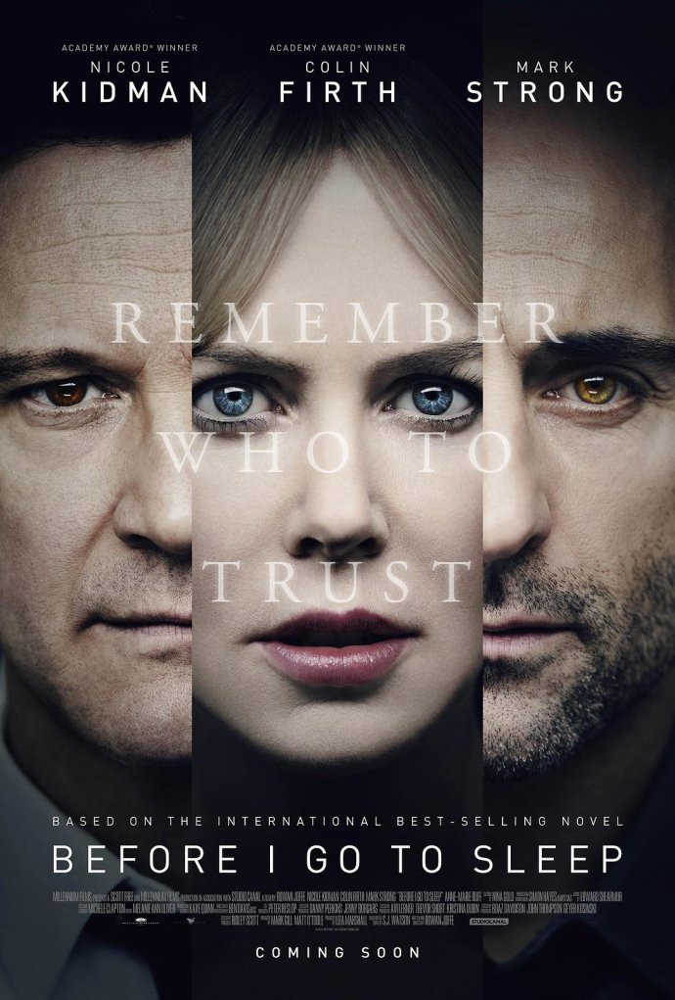
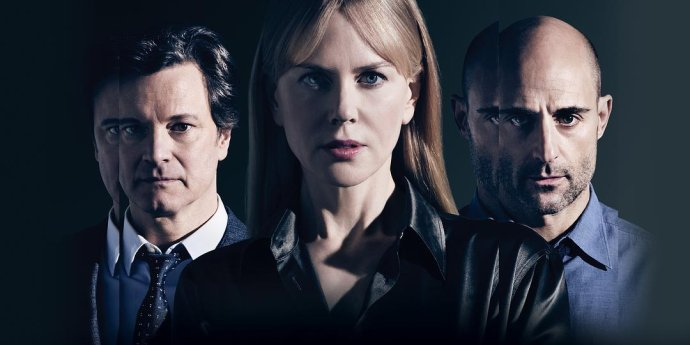
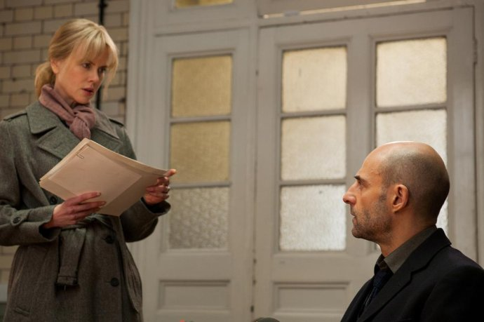
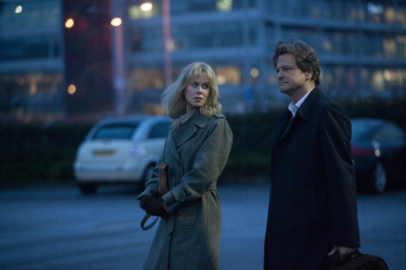

《在我入睡前 Before I Go to Sleep》

			

老公的评论：

　　虽然不是一部新电影，但是因为知道原作小说，所以想找来看很久了。

　　整体来说，这部电影虽然演员少，情节简单，但是并没有让我失望。《在我入睡前》其实只有三位主要演员，即便加上那个点破真相的红发克莱尔，也只需要四位演员就够了，而克莱尔甚至可以只出现在电话当中……，能够把一个简单的故事表现的如此之好，由衷地佩服编剧和导演。

　　我觉得这并不紧张激烈的电影能够让我看完并且觉得好看，最主要的原因就在于电影的一开始就抛出了能够引起人思考的疑问，这个疑问让我不知不觉地就把电影看完了。

　　我认为这部电影设置的悬念很好——真相——表面上看女主是在寻找自己受伤的真相，但是实际上真相远不止一个……

　　反转、反转、再反转，我不想做过多的剧透，真的对悬疑片有兴趣的朋友还是自己看吧。作为喜欢电影电视剧的我，在电影的开始也设计了很多的可能性，甚至想到了女主才是真正的奸角一号，结果发现……

　　哈哈，值得看的一部电影！

老婆的评论：

　　这部电影挺惊秫的，当真相一点点揭穿时，真让人意想不到啊。

　　这部电影用简单的人物，甚至场景都挺简单的，把一个故事拍摄的如此成功，我以为这部电影是部好电影，而且就故事本身我觉得很好看。

　　我真心的没想过这个问题，原来本（科林·费尔斯饰）根本就不是本，本这么深情的相守，原来里面还有问题，对于克里斯廷（妮可·基德曼饰）来说，要寻找真相吗？

　　故事的开局其实挺简单的，克里斯廷每天早上起来就忘了昨天之前的事情都要靠本来提醒之前的事情。她有的时候做梦，有些片段，这些本都没有告诉过她的，她看心理医生纳什（马克·斯特朗饰），纳什给了他一部摄像机，让她每天记录自己的信息，而纳什在本离开后与她联系。摄像机里的信息越来越多，她发生本还有隐瞒她的事情。

　　直到有一天她以为本可以相信了，她把自己看医生的事情与本摊牌，可本的反应却很奇怪。之后本终于不愿意再演下去了，他要恢复自己的身份……

妮可·基德曼&马克·斯特朗

妮可·基德曼&科林·费尔斯

上映年份：2014							
		
http://blog.sina.com.cn/s/blog_52187ba90102x8un.html
