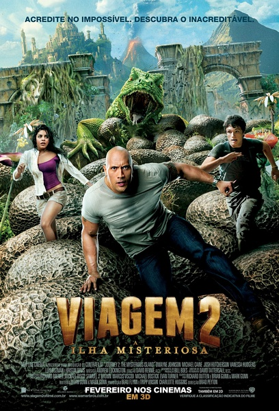
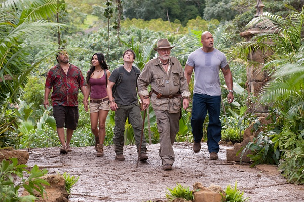

《地心历险记2：神秘岛》

			

老公的评论：
 
　　这部电影和我想的并不大一样。这到不是说我期待着看到多么奇妙的特效，只是“骑蜜蜂”这种桥段本身，实在是显得有点土气了。
 

　　我是很喜欢科幻的，只是比起凡尔纳来，我更喜欢的是威尔斯的风格，凡尔纳的小说多少有一些沉重的感觉……，神秘岛在我看来也有一些沉重，说起来，我好像不是很喜欢尼莫船长……
 

　　看这部电影，其实是冲着强森去的，但他扮演的角色并不是让我觉得很顺眼，除了《南方公园》，他的这个形象在我心中又把他自己毁了一把。
 

　　还是说亮点吧，这个电影让我们觉得最有意思的地方就是那些“小象”，真的想抓两只回家养着，特别是它们最后还可以在海底游泳，应该不会因为神秘岛的崩塌而惨遭不幸，这样就最好了。
 
　　这个电影的营销做的很成功，让我的心理期待很高，也许就是因为这样吧，看过后才有一些失望……

老婆的评论：
 

　　这部影片在看之前是有些期望的，或许正是这种期望让我对这部影片有些先入为主的高标准，导致看完这部影片后，觉得整体上并没我想象的那么好，可能还有些许的失望。
 

　　没有特别的怪物，只是把物种的大小给颠倒过来了，大象变小象，这小象完全可以养成宠物了，蜥蜴变大动物了，最神奇的不过就是可以骑骑蜜蜂而已，而鸟是绝对的掠夺者，刺激的行为也只是被鸟追追，要我说一点也不惊险，巨石强森就失去表现的机会了。
 
　　找的古城在这也似乎失去了意义，很快就要被淹没了，额，要我说最想得到的就是那座金山了，可惜什么也带不走。
 
　　这样说还好我不是凡尔纳的迷，真没什么特别的东西。
上映年份：2012							
		
http://blog.sina.com.cn/s/blog_52187ba9010132rl.html
