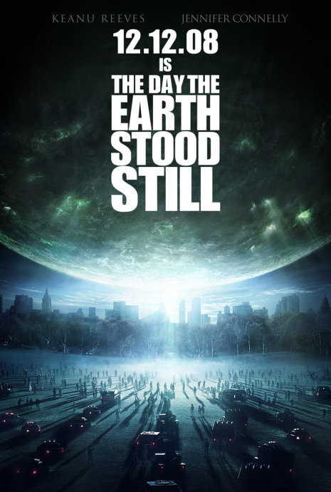
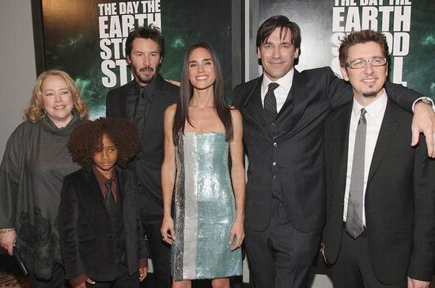

《地球停转之日 The Day the Earth Stood Still》

			【夫妻影评】《地球停转之日 The Day the Earth Stood Still》

 

老公的评论：
 

　　可能会得罪很多人，但我真的其实一直没觉得基努·里维斯特别出色，他并没有什么特别的印象留在我的印象，如果说《黑客帝国》和《驱魔神探》的话，留给我印象深刻的也是剧情和耍酷的造型，恐怕换个类似的演员也差不多。呵呵，但这并不是说我讨厌他，只是不会为他尖叫失眠就是了。

　　对于翻拍的电影，我的感觉一直是很一般的，这部电影虽然有出彩的地方，但终究没有走出前作的阴影。
 

　　最近在很许多朋友聊科幻的话题，身为地球人，看到外星人可以任意处置地球生命，总觉得有一些气愤，难道我们人类真的这么渺小？不过我觉得有一点到时合理，如果外星人到了先到了地球，而不是我们先发现了他们的原住地，那么说明他们的科技水平一定是高于我们的，反正目前阶段，造访地球的外星人，我们是绝对打不过的，只好投降了，唉！
 
　　这部电影外星人毁灭地球的方法也很独特，另类蝗灾，太可怕，好像他们的科技是针对碳钢文明的，我们太被动了。
 
　　还是好好努力，做好本职工作吧！我一直相信如果这个世界每个人都做好该做的工作，世界就会是美丽的。
 
　　在查资料的时候注意到那个小朋友原来是威尔·史密斯的儿子，不错！
 
老婆的评论：
 
　　科幻元素的东西，老公都喜欢。在老公的影响下，我也跟着喜欢这类的作品，喜欢科幻电影的朋友，可以看看这部电影。
 

　　头一次看到外星飞碟是一个球，而从球里面滚出来的东西，最终竟是一个地球人的长相的外星人克拉图。外星人的到来总是让人很是紧张，战争随时要爆发。科学家海伦对克拉图却没有这种敌对的态度，她甚至帮助克拉图逃跑，正是她与她的继子雅各布，才让人类得以保存。
 
　　主演基努·李维斯还是挺帅，挺酷的，脸上总没有太多的表情。看介绍说雅各布是威尔·史密斯的儿子，看来他继承了表演天赋。
 

上映年份2008
 
 
主演
Klaatu……Keanu Reeves
Helen……Jennifer Connelly
Jacob……Jaden Smith							
		
http://blog.sina.com.cn/s/blog_52187ba90100n5v0.html
