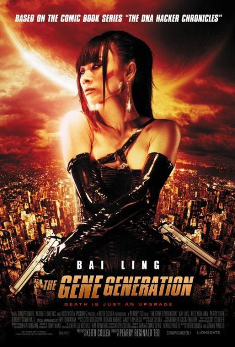

《基因世代 The Gene Generation》

			【夫妻影评】《基因世代 The Gene Generation》

老公的评论：
 
　　从科幻的角度来说，我觉得这个片子还是有一些看点的。
 

　　如果人类可以自由改变生物的DNA，会是怎样的一番景象，也许会像电影中所说的，药物将失去价值，医生也掌握这一门技术就够了；再不就是发动DNA战争……，会是怎么样，我都想象不出来。
 

　　电影中的城市、生活都是架空的，但人物性格塑造又是很地球化的。正如老婆大人所说，看完了之后，觉得这部电影不像是一个科幻为主的片子，更像是一部讲亲情为主的片子。
 
　　小成本的电影，还想要做特效，弄得不好就会像这部电影那样，让人看着不觉得刺激，而是觉得恶心。
 
　　白灵也是我听说过很多次名字的演员了，我相信我看过她出演的电影也不止一次了，但还是没认出来，呵呵！
 
　　这部电影的风格有点哥特，如果用我认为最准确的字句来描述，我觉得应当是“宫崎骏式末日世界背景下的哥特风格”。
 
　　喜欢科幻的朋友可以把这部电影当成一种尝试，这部电影确实能给我们带来一些不同的想象空间。
 
老婆的评论：
 

　　整部影片显得挺沉闷的，并不是很精彩，虽然故事是科幻影片，除了天空中飞过的几只船，还有几个身上长虫子的人，其他的并没有什么出彩的地方，与其说是是科幻影片，还不如说是一部讲亲情的影片，整个故事基本上是围绕米歇尔（白灵饰）与弟弟杰克之间的亲情展开的。
 
　　作为杀手米歇尔扮相还是挺酷的，作为姐姐来说米歇尔对杰克也没得说，该做的不该做的都做了，可惜弟弟杰克实在不像话。
 

　　想想这部影片，实在没什么可值得记下的东西，哦，因为这部影片，还特意去查了一下白灵，原来她是一个靠“脱”上位的华裔女星，怪不得在电影中非要露个点什么的，对于这部影片来说，这段好像并没有什么意思。
 
上映年份2006
 
导演
Pearry Reginald Teo
皮尔瑞·雷金纳德·迪奥

编剧
Keith Collea
基斯·科尔利
Pearry Reginald Teo
皮尔瑞·雷金纳德·迪奥
 
主演米歇尔……白灵							
		
http://blog.sina.com.cn/s/blog_52187ba90100nnth.html
