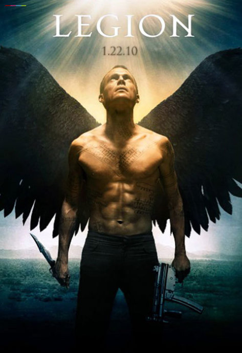

《基督再临 Legion》

			【夫妻影评】《基督再临 Legion》

老公的评论：
 

　　在美剧《邪恶力量》之前，对于有很强宗教色彩的影视作品我一直感觉一般，但自从《邪恶力量》成为了我们的最爱之一以后，我们认识了更多的天使与魔鬼，也了解了一些西方神话中的正义与邪恶的斗争。
 

　　感觉上，这部电影多少有些反传统，特别是当那些被天使附身的人类变得和很多电影中的恶魔一样的时候，我知道这部电影是一部塑造英雄的电影，而这个英雄就是迈克尔，我一直很奇怪为什么他的名字的汉字总被写成“米迦勒”，口音真的很可怕……
 

　　至于内容，我觉得这部电影没有太多创新的地方，说起质的部分，它只是用另一种不同的方式演绎了“僵尸片”。但其中有一句话却给了我很深的感触“You
gave him what he asked.I gave him what he
needed”。这句话是迈克尔说的，而句中的him指的是上帝！我认为“给予上帝他所需求的”将成为很多反叛天使的解释，我认为《邪恶力量》也将使用这样的概念。
 
　　看起来，这部似乎在宣扬上帝造人的电影，却从另一个层面否定了上帝的“万能”。
 

　　在片子中间有一些黑色的部分，当帕西去救那个丧父女人的时候，当凯尔去救那个他以为被“僵尸”围困的小朋友的时候，连个人都死了，难道人们不该有热血，不该有同情心吗？
 

　　很久以来，我一直试图让自己学会理智地处理一切，学会所谓的冷血，但人是活的，心怎么会死呢？我更希望看到好人有好报的电影，即便是他们错帮了坏人，给他们一个教训也就够了，不必付上生命的代价吧？
 
　　喜欢天使与恶魔的人不可错过的概念电影，不要忘记哟！
 
老婆的评论：
 

　　看电影时，老公说这部影片更像另类的僵尸片。同时，老公觉得这部电影更像电视剧《邪恶力量》的浓缩版，怎么样都好，只要电影还能看。
 

　　整体来说，这部影片我觉得还可以。抛开宗教的问题，西方的上帝、基督、耶稣这些我了解的不多，所以更深层次的东西，不是拍给我看的，就单这个电影，他很完整。在《邪恶力量》中我也看到上帝对人类失去信心后派天使来毁灭地球，这次上帝派了大天使迈克来毁灭地球，我很奇怪，西方的神话，为何上帝老是要来消灭人类？还好这次迈克来保护人类的希望之光一个未能出世的婴儿。
 

　　电影开头片段，让人挺有想象力的，一位天使下凡了，割掉自己的翅膀，西方的神不会变吗？这个割自己的翅膀多疼啊。然后抢了好些的军火装备。

　　
　　这一场保卫战发生在一个郊区的酒吧中，酒吧老板的儿子叫吉普，为人很好，迈克因为吉普觉得人类还不至于要被毁灭掉，一个叫查理的女招待，正是她怀着这个带给人类希望之光的婴儿。迈克来到这里是为了确保查理能够顺利的把婴儿生下来。
 

　　接着各种化身人类的怪物出现在酒吧周围，酒吧里的人一次次的消灭怪物。婴儿降生了，加百利与迈克一仗，让迈克人类模样死了，加百利要去杀带着婴儿逃走的吉普和查理，关键时候迈克出现了，这次他变回了天使的模样，也变厉害了。
 
　　人类将如何？留给吉普查理和婴儿是一条什么样的路？需要发挥一下大家的想象。
上映年份2010
 
导演Scott Charles
Stewart
斯科特·查尔斯·斯图瓦特

主演Michael……Paul Bettany
迈克尔……保罗·贝坦尼							
		
http://blog.sina.com.cn/s/blog_52187ba90100nntg.html
