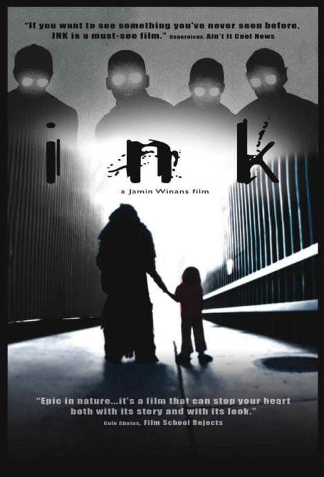

《墨水 Ink》

			【夫妻影评】《墨水 Ink》

老公的评论：
 

　　首先，值得肯定的是这个电影的创意部分，造梦者的创意理念很有特点，而梦中世界的画面也很完美，还没看过《盗梦空间》，但觉得对梦境的描写是让人向往的，当然，有制造美梦的神仙，也有制造噩梦的魔鬼，才对，才好看。
 

　　墨水讲述的故事，虽然是通过梦境的手法来描述的，但讲的却是心灵，从本质上来说，有种故作温情的感觉，但考虑到影片的制作成本，拍成这样已经很不错了。
 

　　这不是一部商业型的电影，但本身包含了那么多魔幻的元素，好像也显得不是那么文艺了。影片中病没有太多精彩的打斗场面或者说很炫的高科技场景，而那个面具的特效看上去只会显得很搞笑，但这不影响影片的主题。就这一点来说《墨水》做的很好。现在的很多电影烂，都是因为导演想在有限的时间里表现无限的内容，不像这部电影，主题很鲜明，很小，但定位很准确。
 
　　如果要打分的话，我给《墨水》的分数虽然到不了达到优秀的85分，但也应当是75分往上的。
 

　　对了，还有那个盲人探路者，颇有一些宗教文化的色彩，那个事故的设计也算是很用心机了，如果看腻了莫名的大片的话，不妨来换种思路，看看这部《墨水》。

老婆的评论：
 
　　此墨水非彼墨水，此墨水只是一个名字而已。
 

　　这部电影的感觉，有点乱，刚开始这一段有点重复。而墨水只是男主人公的将来或者男主人公的潜意识？我在网上搜索了一下，称这部影片为好电影的人不少，我还没有这种感觉，不可否认的是，这部影片的创意不错，风景不错，只是好像缺少点什么。
 
　　黑夜里总让人很有很多的幻想，而睡下的人们做着不同的梦，有好梦有噩梦，这些原来是由一些人看不见的力量在左右。
 

　　电影的小女孩艾玛的灵魂，被墨水带着了，她的命危在旦夕，而化解这一切的是她爸爸约翰的选择，看了很久才知道墨水就是艾玛的爸爸约翰，约翰为什么变成墨水，这就是这个故事精彩的地方，总之电影的结局是约翰战胜了自己，也同时解救了艾玛。
 
　　怎么讲电影里出来的这些造梦者、探路者……，还是有点神秘的。
 
上映年份2009
自导自演Jamin Winans
主演John……Christopher
Kelly							
		
http://blog.sina.com.cn/s/blog_52187ba90100kogu.html
