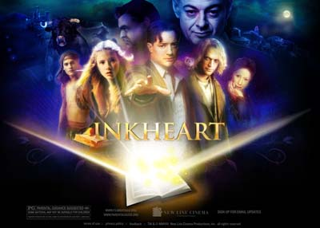

《墨水心 Inkheart》

			【夫妻影评】《墨水心 Inkheart》

老公的评论：

　　看到网上有很多朋友觉得这部电影不好看，而且有很多很多的理由，关于这些，我一直坚持着自己的观点——没有漏洞的电影是找不到的，我们要挑拣的，不应该是电影中的瑕疵，而应该是那些能让我们感兴趣，笑出来，或者是久久不能忘记的东西。

　　《墨水心》，不知道把它算做哪一类电影才合适，男主人公不能说是不热的演员，故事中“银舌”的说法也很吸引人，“灰手指”的出现更是把剧情带向了一个很时尚的境界之中，但后来，好像是编剧或者导演改变了思路，这部电影变成了一部绝对的童话故事，所以，我觉得这部电影的前半部分可以给那些正在写作没有灵感的人来看，估计会冒出来一些新奇的想法，而这部电影的后半部分，适合给小朋友们来看，因为他们确实挺卡通的……

　　不知道现在应该读童话的年纪的孩子们，还有几个人知道《OZ国历险记》，那他们应该就不认识那只小狗了吧？从这个角度来看，这部电影在文化上是针对西方的，恐怕这一点是阻碍它成为一部被广泛接受的电影的重要原因。

　　现在我和老婆大人看电影，还是有一点挑剔的，毕竟可选择的电影电视剧作品有那么多，这个不看了，还有别的，所以我觉得我们看完而写出评论的那些文艺作品，都是那些值得我们看完，值得我们评论的作品。

　　曾经认为演“蝎子王”的演员是“憨豆先生”，后来才发现是演《糖果街大道》的那个哥们，感觉差了不少！嘿嘿
 

老婆的评论：

　　不可否认这是一部好看的电影。我喜欢这部电影是因为它有着神话色彩的剧情，让人遐想无限，还有着对爱执着的男女主人公，这一切都似乎符合我的胃口。

　　最近看关于很多拥有某种特异功能的人的电影，真的很幻想自己也有任何一种不同凡人的本领。这个电影讲述的男主人公的本领也很有意思，只要读书中的那些文字，那么书中的人物什么的都会出现在你的身边，不过有一个不好的代价就是身边的某人会被交换到书中去，真的很有意思。

　　男主人公弗查特在给女儿读《墨水心》这本书时，不小心把书中邪恶的魔羯王及魔术表演师都读出来了，但把自己心爱的老婆读没了，同时书也偷走了。在接下来的时间里，他一直在寻找《墨水心》要找回自己的老婆，而魔术师又在寻找他，让他把自己读回书中。在这段过程中，故事错综复杂的发展着，在他女儿等人的帮助下，最终他找回他老婆，魔羯王又回到了他自己的世界，魔术师也回到自己心爱人身边，是一个很美的大结局。
　　
 
上映时间 2009
 
部分演员职员表
 
原著
柯奈莉亚·冯克（Cornelia Funke）

导演
伊恩·索夫特雷（Iain Softley）
 
 
主演
Silvertongue……Brendan Fraser
银舌……布兰登·费舍
Meggie……Eliza Bennett
麦琪……伊丽莎·班尼特							
		
http://blog.sina.com.cn/s/blog_52187ba90100guov.html
