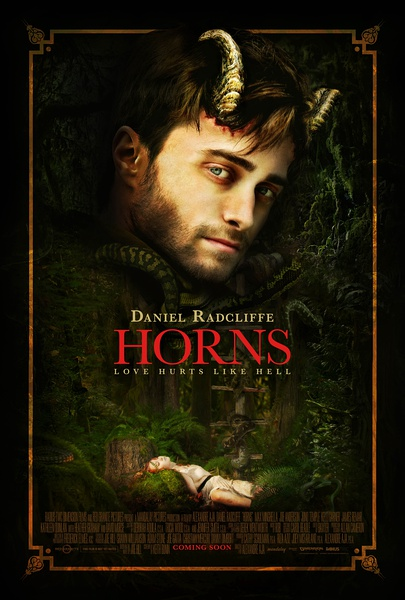

《复仇之角 Horns》

			

老公的评论：

　　因为没看过《哈利·波特》，所以不知道这个电影的主人公居然是位巨星。

　　看剧情，看场景，我都以为这部《复仇之角》是个小成本，因为有一些奇幻题材，我们两个居然在不知不觉中就看完了，除了结尾的部分有点不明白之外，整个故事还是节奏挺快的。

　　这是一个复仇式的电影，但是复仇的方式很怪，主人公居然可以变成恶魔，拥有一些邪恶的本领，但是在打斗中又很面……

　　总之这部电影有一种奇怪的感觉，奇怪的开始，奇怪的结束。

　　说到开头部分，这部电影的开篇不错，没有平铺直叙，而是先进入中间环节，然后让现实与过去交替进行，不至于看着太着急，也不会让人觉得太无趣……

　　不过，还是估计这部电影会被大多数人不喜欢！

老婆的评论：

　　在我看来，这部电影非常的有意思，当然，因为文化的差异，可能没有百分百的理解，但不影响我看这部电影。

　　也让我学会一件事情，不要用自己意愿去为对方做出选择，这种自以为成全的方式在相爱的人使用非常残忍，造成更大的悲剧，如本片。

　　假如梅琳没有隐瞒自己身体原因如实告诉伊格，或许还能幸福的在一起一段时间，或许分手，后来的事情就不会是这样了，梅琳她自己不会死于意外，伊格不会被人怀疑是杀人犯，为她变成了恶魔，最后死了。

　　说这部电影有意思，是因为看了一段后，我怀疑真正的凶手是李，让我消除怀疑的是因为和伊格谈话的人都会说实话，李的话没有问题，而后来揭露这是因为十字架。这就是文化的差异，假如我知道十字架能挡住恶魔诱惑的话，我想我会往这个方向猜测。

　　长一对恶魔之角是祝福也是诅咒，能帮助伊格找到真正的凶手是祝福，可是天天听到的都是对方最邪恶的想法，那就是一种诅咒。

　　没看出伊格·佩西斯的演员丹尼尔·雷德克里夫是演哈利波特的小孩，不是很像。

上映年份 2014							
		
http://blog.sina.com.cn/s/blog_52187ba90102vsrd.html
