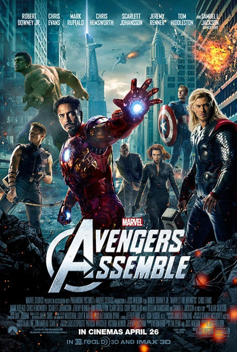
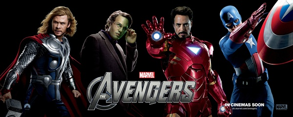
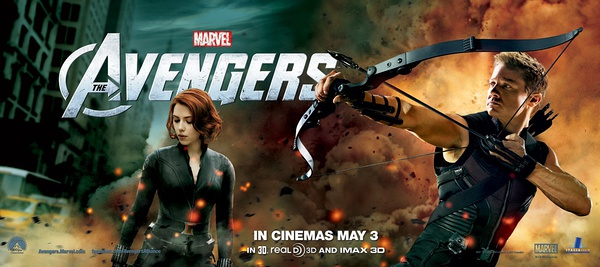
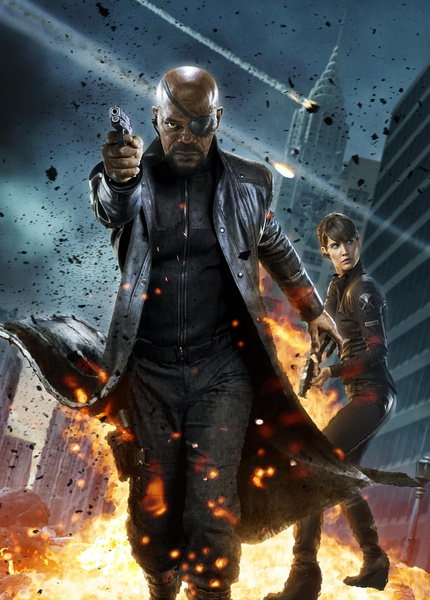
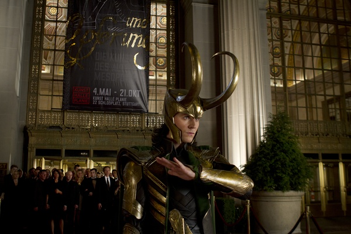

《复仇者联盟 The Avengers》

			

老公的评论
 
　　很酷的电影，剧情方面当然是超人战士保护地球了，题材没有什么太新的，但是场面够大。
 

　　相关的影视作品中，我们只看过《钢铁侠》和《绿巨人》，《雷神》、《美国队长》和《鹰眼侠》我们都没有看过，但是这并不影响我们观看这部电影时的感受。
 
　　电影中的动画特技设计的还算不错，那种外星恐龙式的飞船挺逼真，也挺酷的。
 

　　其实这个故事的题材很符合我的幻想：如果真的又外星人侵略地球，那么因为他们先找到了我们，所以他们的科技一定是优于我们的，因此靠地球现有的军事力量取胜的难度就太大了，想要保护地球，只有依靠地球上的“异形”——特殊进化的产物才能够完成。
 
　　感觉上要是再有孙悟空就好了，哈哈！

老婆的评论：
 

　　这样的影片看起来真是过瘾啊，这种视觉上的享受真的很棒！反正看的我特别的兴奋，而且这种电影结果大家都清楚的，都会是正义战胜了邪恶，地球人搞垮了外星人的入侵，所以，不需要太纠结，享受这几个大家伙的强悍吧。只有那段以为钢铁侠没得救时，真让我紧张了一下。
 

　　把这样几个大家伙搞在一起不自己打起来就不错了，不过，让他们一起去对付外星人还真是不错，当洛基把地球的大门打开后，外星人如潮水般的过来，把这个大家伙累的够呛，还好的是钢铁侠在关键时刻把导弹送入外星人基地，不然，这些外星人要打多久才算完啊。
 
　　雷神有点意思，他的大锤子到底有多重？连绿巨人都拿不动。不过看来最厉害的还是钢铁侠了吧！

                         《鹰眼侠》我们没看过，所以这两个角色不了解

                                        
这位领导很强悍

‘金龟子’——老公给他起的外号
上映年份 2012							
		
http://blog.sina.com.cn/s/blog_52187ba90101913o.html
