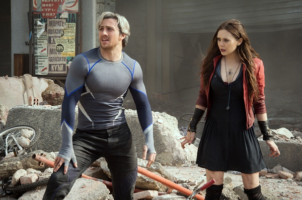

《复仇者联盟：奥创纪元 Avengers: Age of Ultron》

			

老公的评论：

　　看漫威电影的感觉，就像我这个年纪的人总觉得《龙珠》系列的动画片是好看的相反一面，因为对这套漫画没有感觉、感情，所以怎么也无法真正投入地去看这部电影，只能是看热闹了！

　　钢铁侠还是一个不错的概念，他代表了地球的顶尖科技，但是其他的主角就是怪物……，这点感觉美国人和日本人的漫画逻辑是统一的——地球必将遭到怪物的侵袭，而能打败怪物很与可能是另一种怪物……

　　这部电影的前半部分有些沉闷，铺垫过长，对于原来的复仇者们来说，“快银”已经无敌了，他们拿快银的速度根本没办法，这小子要是在中国送快递，一天得挣多少钱啊？快银之后又出来一个幻影，更厉害，但即使是幻影也打不过奥创……

　　奥创带着一大堆机器人打复仇者显得不公平，但是复仇者一堆打奥创一个也不见得磊落啊……

　　因为连这些复仇者的名字我都记不住，所以就是看热闹，总之地球是不会被摧毁的，所以好人必须获胜。

　　复仇者们衍生出来的美剧也有不少了，但是也很难看得投入，看来这个系列不是我的菜！

老婆的评论：

　　剧情刚开始的时候有点拖沓，前期交代时间太长，看了快一半我才觉得好看起来。

　　一部电影主人公太多，也很有问题，这个给点时间，那个给点时间，我看电影想塑造好每一个角色，所以，这部电影显得时间比较长。

　　有的时候，我觉得像这类电影挺没意思的，结局总会是正义必胜，复仇者联盟代表的是正义的一方，他们有所牺牲或者一点牺牲都没有的情况下，总会赢得胜利。只是看打的是谁了而已。

　　简单来说，我觉得这部电影可以看，看看高科技，未来的人工智能，一些打斗的场面还是挺震撼的。但观后感却是不多的。

　　未来的世界是属于机器人的世界？我在思考。

新加入的姐弟

上映年份　2015							
		
http://blog.sina.com.cn/s/blog_52187ba90102w7kq.html
