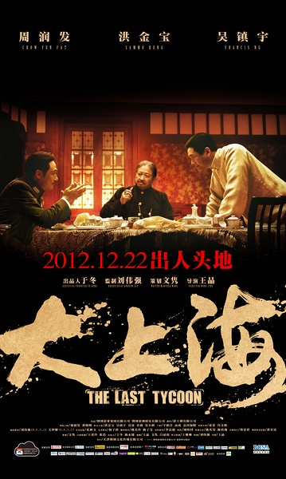
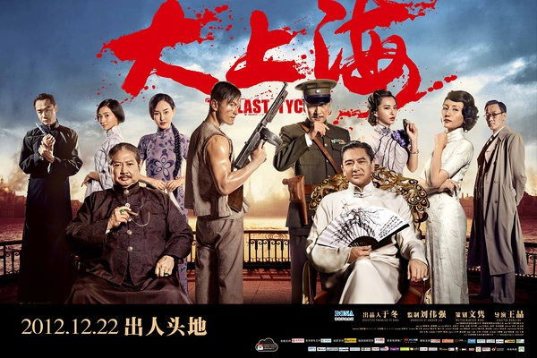

《大上海》

			

老公的评论
 

　　关于上海滩的故事已经有很多很多了，这个故事，背景虽然依旧是一个毛头小子在上海滩的崛起，但真正左右故事发展的却是两段友情、两段爱情与一颗正义之心。
 

　　成大器是主人公，所以四段情都是和他有关的，和叶知秋的“发乎情止乎礼”、阿宝对他的“死心塌地”、对洪寿亭夫妇的尊重爱戴、和林坏的肝胆相照再加上“什么都敢做，就是不敢当汉奸”完完全全地带我们走进了主人公的内心世界，很容易理解，很容易有身临其境的感觉。
 

　　王晶的导演水平是一流的，这部电影在我看来，每当我升起一个与剧情有关的念头的时候，刚好后面就会回答我的答案，比如我刚想到“成大器和叶知秋是怎么分手的？”导演就给出了一个合理的解释，原来是不可抗力，比如我刚想过“成大器曾经山盟海誓，但是为什么和阿宝在一起”，剧情也告诉了我原来是和叶知秋的分手在先……
 

　　唯一让我不满意的，是为什么成大器在结尾甘愿殉情，是真的有什么含义还是纯粹的就是要一个悲剧结尾？我一直觉得，如果喜剧结尾能够做到感人的效果，会比悲剧结尾感动人心的效果震撼的多。
 

　　黄晓明、周润发、高虎都演的很不错，吴镇宇演这种心理变态那更是不用说了，第一次觉得袁泉确实有“大哥的女人”的派头，不过袁莉扮演的大嫂显得稍微单薄了一些。
 
　　真的觉得应该拍一部好的关于杜月笙的连续剧了，一定很有看头。

老婆的评论：
 
　　为什么成大器和小胖要等着日本人来把他们打死？不理解。他们早点走了不就行了嘛？
 

　　不管怎么样，主人公成大器（周润发饰），没有当上汉奸，最后还能与大汉奸茅载（吴镇宇饰）干上一架，并能去对付日本人，这样的过程已经让我很激动了，所以不能接受他们最后被打死这一结局。
 

　　这个影片，除了讲年轻的成大器（黄晓明饰）如何在大上海闯出一番天地，同时对于这个角色的感情诠释的很好，是一个真性情的大男人，他爱叶知秋，但也尊重她的选择，在叶知秋结婚后他接受了阿宝，之后在上海又遇到叶知秋，他保护她，并在上海有危险时把能出逃的机会给了叶知秋与她的丈夫。　　
 
　　袁泉演绎的叶知秋很有大哥女人的范，我们觉得她很适合这个装扮。高虎把林坏这一角色也演绎的不错，话不多，但极讲义气。

上映年份 2012							
		
http://blog.sina.com.cn/s/blog_52187ba901019j87.html
