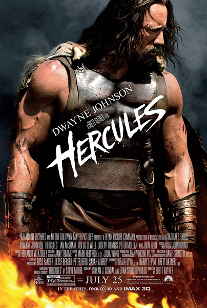
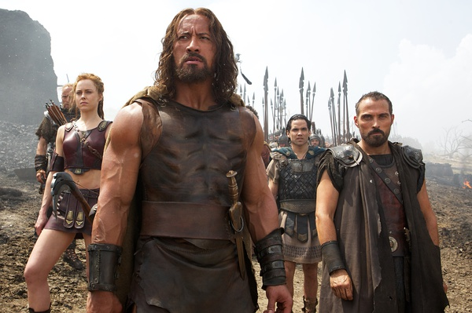
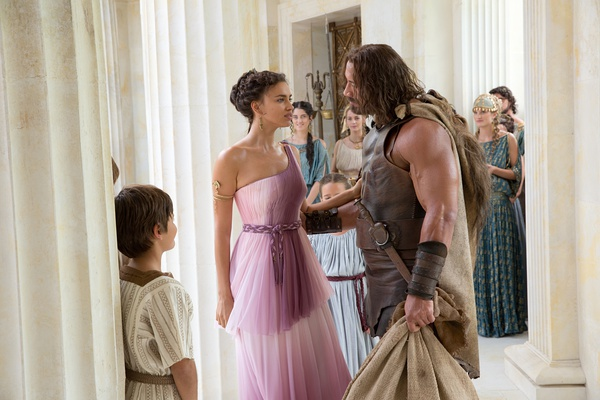

《大力神：色雷斯之战 Hercules》

			

老公的评论：

　　这真是一部好看的电影。

　　首先，我觉得强森个人形象和海格力斯太接近了，如果海格力斯有一个人间的形象的话，那么强森无疑是最好的代言人。这个感觉很像欧阳奋强版的贾宝玉，仿佛这个人的降生就是为了扮演这个角色而存在的。

　　其次，虽然是冷兵器时代的战争，但是打斗真的很激烈，很符合古代欧洲战场上战争的感觉。对于主人公们的塑造都很到位，无论是霸气、凶悍、稳健、精确……，一切都显得很合理，让我很希望在战斗的时候能够和这样一伙人搭档。

　　再次，片子的节奏非常紧凑，没有浪费，即使是海格力斯被抓住的时候，也没有浪费篇幅——既然最后他要获胜，那么其实之前受了什么折磨都不重要了。

　　最后，片子的开头很精彩，让我们真的以为这是一个神话故事，后来，结果说明——神，不过是人造的，片子的结尾却又从另一个角度诠释了因果：最不希望海格力斯成为英雄的是赫拉，而当海格力斯推到了赫拉神像的时候，对于他不利的一切都结束了，一切都证明了——只有海格力斯才是不可战胜的。

　　续：在片尾字幕的时候，用动画的形式描述了海格力斯和他的团队一起去完成“十二任务”，其实对比“说书人”的精彩演讲，很有喜剧效果。

老婆的评论：

　　我很喜欢这部电影。因为我本身就很喜欢中世纪的故事，而这部电影创造的人物——海格力斯，这么一个大力神，是力量，领导力的结合体。

　　有时候，我很不理解，那些迫害自己臣民的皇帝们，尤其是一个毫无权利欲望的大将，利用好他，对自己是一件多好的事。海格力斯的国王，因为他的影响力，因为他的无所求，杀了海格力斯的妻子孩子再嫁祸给海格力斯，哎！又是一个昏君。

　　这个电影刚开始的时候，我以为是一个神话故事，关于海格力斯的神话故事，但却不是，只是以海格力斯为首的一伙雇佣军，他们有一个非常会编故事的队员。这么看来，什么好东西都需要包装。

　　海格力斯被色雷斯国王科杜斯雇来解决战争问题，而这一切只是科杜斯的自演自导的一场阴谋而已。在拿钱走人和大义之前，海格力斯选择了大义。

　　这几场战争，场面大，个人能力也很重要，我觉得比现代战争有意思多了。等我穿越回古代，我想，我该去当一位……

　　强森很适合这角色。

　　《热浴盆时光机》有创新，看着有点意思。《热浴盆时光机2》用一句话评论，很低俗，导致我们看一半看不下去。

上映年份 2014
							
		
http://blog.sina.com.cn/s/blog_52187ba90102vtah.html
