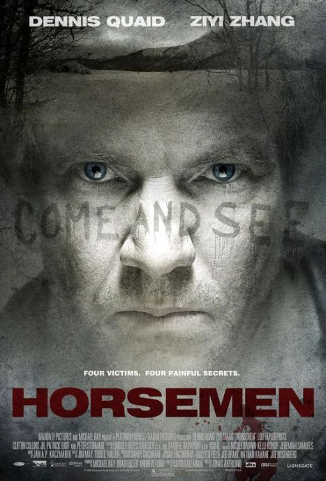
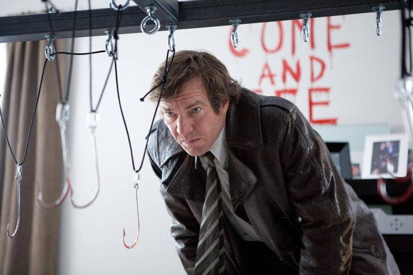
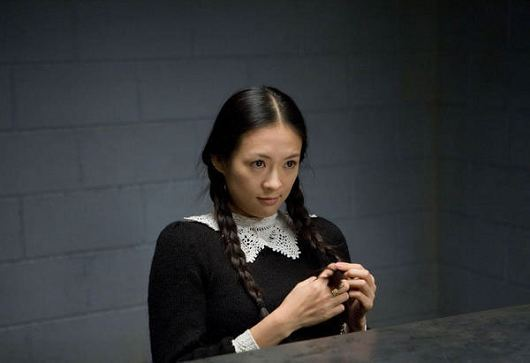

《天启四骑士 Horsemen》

			【夫妻影评】《天启四骑士 Horsemen》

老公的评论：
 
　　如果我可以重新选择，我绝对不会再看这部电影。
 

　　这部电影让我失望的原因，主要在我自己，看到这样的电影名字，让我以为这部电影是一部魔幻剧，毕竟天启四骑士总是要和世界末日联系起来的，本来是个我和喜欢的题材，结果看到的是血腥和变态。
 

　　口味不同吧，我们并不害怕看什么恐怖的或者血腥的电影，甚至是心理变态的题材也可以接受，但变态不要变得太傻，或者说文化的差异太大，站在我现在的立场，无法了解那些美国人变态的理由。
 

　　对了，找到合适的词儿了，一部电影可以有许多许多的元素，但不该包含“恶心”，恶心的电影，不管有多少人喜欢，反正我不喜欢。
 

老婆的评论：
 
　　看过《邪恶力量》让我以为这是一部神话或者科幻类的电影，看过之后才发现并不是如此。
 

　　整个来说，这部电影没对上我的胃口，让我在看整部电影的时候并没全心全意，其实看了一段以后，老公就说不好看，我想他应该是不想看下去，但我对Alex是否是其中的骑士，充满了好奇，正像老公是觉得章子怡是其中的坏人一样。
 

　　这部电影最终探讨的是父母与孩子之间的关系，随着社会的发展，生活的节奏都非常的快，作为家长，有的时候不知为了什么，而忽略了和孩子的关系，Alex最后的这段话交代的也是如此。
 

 
上映年份2009

主要演员Breslin……Dennis Quaid
Kristin……章子怡							
		
http://blog.sina.com.cn/s/blog_52187ba90100lmm4.html
