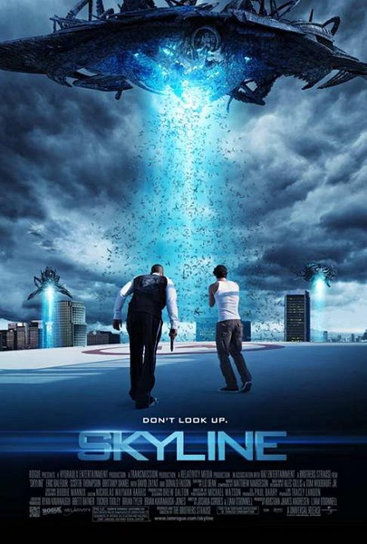
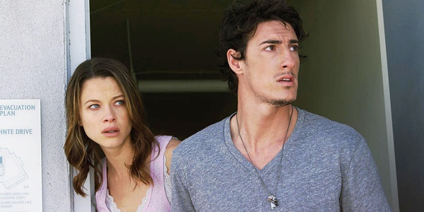
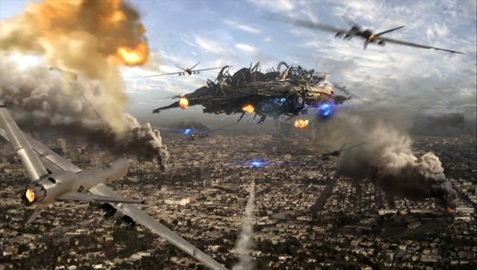

《天际 Skyline》

			

老公的评论：

　　这并不是一部大片，是一部恐怖片。
 

　　以往，和这部电影类似的剧情更多地会出现在僵尸片之中——世界一夜之间改变，人们被困于屋中，周围都是会杀人的异形，人们为何去何从而争论不休——只不过这部影片之中没有僵尸，有的是外星人。
 

　　看完之后，我和老婆大人对这部电影并没有什么感觉，反而是对这部电影的续集充满了期待——Jarrod的大脑被装进了外星机器之后，他将如何保护自己心爱的女人以及还没有出世的孩子——真的有值得期待的地方。
 

　　看到很多评论都觉得这部电影很差，我还真没有这样的看法，不能说大成本，多特效就是好电影，像《天际》，在外星人入侵地球的整个事件之中，它之讲述了一个很小的局部，我一直坚信对电影这类文艺作品没有好坏之分，有的只是喜欢与不喜欢，喜欢的，把它看完，不喜欢的，就丢到一边去。
 

　　每个导演都在讲述着一个他自己最懂得的故事，就像我们的人生一样，每个人的生活，每个人的故事，只有他自己最清楚。

 
老婆的评论：
 

　　直到最后，我才有真正的想看这部电影的感觉，可惜，就结束了。其实要电影前期短一些，真正的开始是从外星人肚子里开始的话，我想会更精彩。
 

　　这部影片很长时间给我的感觉是恐怖片，我只觉得这些人都在经历不同的心理折磨，外星人到底来干嘛？把人吸引上去做什么？各种不同样子的外星机器在搜索人吃掉，真是恐怖。后来才知道原来外星人用人脑当能源。
 

　　要说这是一部小成本电影，我到没想到，其动画特效挺好的，虽然主人公们都不是什么大腕吧，但对我们来说，也已是混了脸熟的演员了。
 

　　这部电影的另一条主线，Jerod和Elaine的爱情故事，他们俩之间虽然有争吵，但每次Jerod用中指头轻轻的由上至下的划过Elaine鼻子的那么一个微小的动作，就能让两个人同心协力的，被外星人困在大厦的Jerod建议Elaine一起冲出去，然而他们还是被外星人抓住了，Jerod的脑子就变成了机器怪了，而Elaine因为有身孕被外星人放在一边，没想到变成机器怪的Jerod来保护Elaine，他的那一个划过Elaine鼻子的微小的动作让Elaine认出来，这个时候结束还真让我有点遗憾！

上映年份
2010
 
导演
科林·施特劳斯
格雷格·施特劳斯
主演
Jarrod……Eric Balfour
Elaine……Scottie Thompson
 
 							
		
http://blog.sina.com.cn/s/blog_52187ba90100ypwe.html
