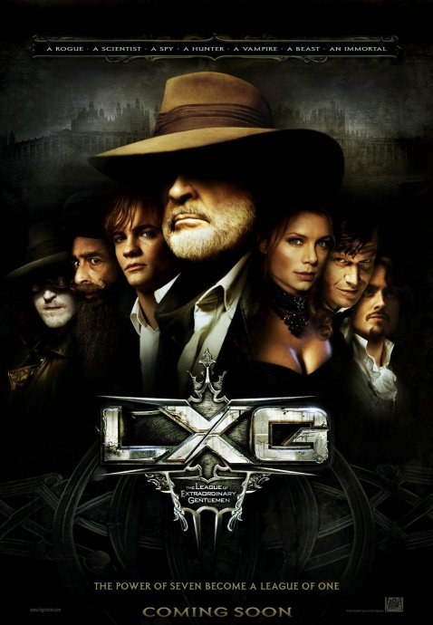
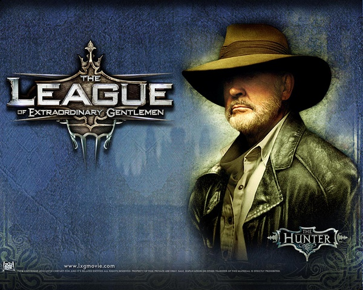

《天降奇兵 The League of Extraordinary Gentlemen》

			【夫妻影评】《天降奇兵 The League of Extraordinary
Gentlemen》

老公的评论：
 
　　这真的是一部好看的电影。
 

　　虽然我没有百分之百明白M为什么拥有了那么强大的武器和科技不选择称霸地球而要当一个军火商，也不明白他为什么要自己组织一支特种部队来毁掉自己的生意，但我绝对明白了这部电影中，M是坏蛋，而特种部队就是要消灭坏蛋的。
 

　　看这部电影，想起的是一个游戏叫《科纳米的世界》，不知道有多少朋友玩过这个任天堂的老款游戏，实际上那个游戏就是把6个经典游戏角色集合到了一起，完成一个更大背景下的游戏。
 

　　隐身人、不死人、吸血鬼、化身博士，怎么样，听着想不想看？反正我想看，到是电影的海报，太突出肖恩·康纳利了，让人觉得这是一个老派的电影，但其实不是，这个电影不老派，而且还很“时尚”！
 

　　近一段时间我们主要在看连续剧，很少看电影，因为我觉得电视剧的篇幅够长，可以很好地完善细节与人物刻画，但这部电影，让我觉得电影也有很多值得慢慢欣赏的好作品。
 

老婆的评论：
 

　　这部电影相对我们刚看的其他两部电影《致命紫罗兰》及《地球停转之日》要看好。吸血鬼米娜、不死人多利安、隐形人斯基纳、变身人杰克、尼墨船长，这些人物都不错。
 

　　一个混乱的时期，有一伙叫魅影的家伙，在大肆破坏和掠夺财富。英女王让M先生号令吸血鬼米娜、不死人多利安、隐形人斯基纳、变身人杰克、尼墨船长、探险家夸特曼来对付魅影，在找到多利安时就开始与魅影斗上拉，意外多收了美国人汤姆，这个7人小组开始了追踪魅影，怎奈多利安是个魅影的人，差点就诬陷了隐形人……。
 
　　头一次看到吸血鬼能叫出蝙蝠的，米娜很强。打架时看见多利安在子弹中来回走，场景也相当的酷。尼墨船长的潜艇很酷。
 
　　看电影的时候，老公在叫《doctor who》的博士，哈哈，结果博士没来哦。
 
　　原来M就是魅影，很意外！
 
　　很为扮演隐形人的演员叫屈哦，最终也没露上自己的相貌。
 
　　电影的最终结局，非洲巫师在夸特曼坟前祈祷，说不定老爷爷又能活过来呢。
 
 
上映年份2003
 
 
主演Sean Connery
Naseeruddin Shah
Stuart Townsend
Tony Curran
Peta Wilson
Jason Flemyng
Shane West							
		
http://blog.sina.com.cn/s/blog_52187ba90100n5v6.html
