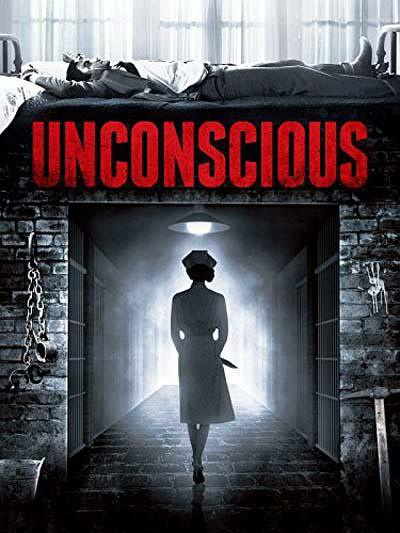
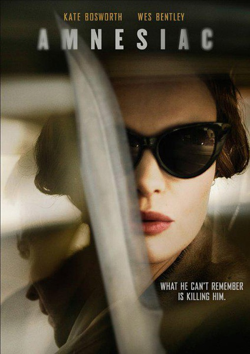

《失忆症 Amnesiac》

			

老公的评论：

　　很怪诞的一部电影，以致于看到结尾我都不知道它在演什么了？

　　看这部电影加上之前的《时光穿梭》，老婆大人的一句话是对的：现在的美国电影节约成本已经到了一个极致上了，两三个演员就可以出演完成。

　　唉，不知道该怎么评价了，觉得这部电影的逻辑真的有点意思，越往后看越糊涂……

　　不过男女主角的颜值都还是不错的，特别是男主角，很有粗犷中不失细腻的感觉，赞一个！

老婆的评论：

　　我以为不以这个结尾结束的话，这部电影还算是一部电影，要我觉得就拍成男主人公是被女主人公挟持的，然后不断的催眠，让他以为是家里的一员。最终这部电影的结局，让我没太懂到底是要表达什么？

　　服了最近看的那几部电影，几个人，很少的几个场景，一部电影就完成了，当然，如果创意好的话，也不是不能接受。

　　我想说的是，这部电影的女主人公真的很变态。在她不断的要求男主人公不要下床时，我总觉得她应该有阴谋，后来又觉得，她可能就是为了重新组合那个破碎的家庭，到最后又打破了我的以为。

　　好吧，我最想说的是，这部电影不值得一看。

上映年份　2015							
		
http://blog.sina.com.cn/s/blog_52187ba90102w7l2.html
