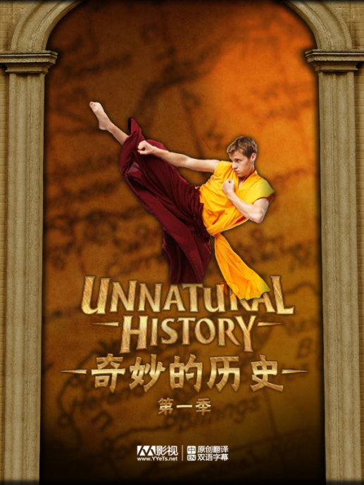
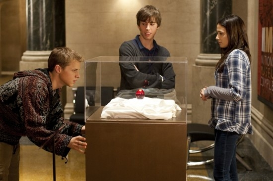

《奇妙的历史 Unnatural History》

			【夫妻影评】《奇妙的历史 Unnatural History》

老公的评论：
 
　　在卡通频道播出的连续剧，多少还是有些不同的。
 

　　剧集中涉及的历史，都是我们这两个“外国人”所不熟悉的，所以，看这部剧集，我体会不到什么有关历史的含义，这一方面甚至我们看不下去的英剧《骨迹寻真》要表现的更好一些。
 

　　不过，我觉得这是一部好看的剧集，而且我会看第二季，说不出什么深刻的理由，只是觉得这部剧集很有趣，三个主人公所经历的故事说惊险又不是太惊险，说精彩也不都是很精彩，但是让人看的很轻松，这一点有点像我们看港剧，不用费很大的精力去思考，也算是一种生活之中的调解吧。
 

　　其实，我觉得关于这部剧集值得思考的是它到底能拍几季，高中生活毕竟就是那么几年，等演员长大了，还怎么拍？估计挺有意思的。
 
　　看这部剧集觉得很纳闷的一点就是美国的高中生基本看着比我们的大学生显得还大……
 

 
老婆的评论：
 
　　怎么说呢？！这是一部好看的电视剧。
 

　　你要问我好看在哪里？我就得想想。第一、这部电视剧的故事都是关于历史的和探宝的，第二、这部电视剧的主人公Henry虽然特厉害，但他掌握的东西在这所高校中并不全行的通，在另两个伙伴Jasper和Maggie的帮助下，他的干出来许多惊天动地的事情。
 

　　奇妙的历史。确实，有很多的历史谜团还需要研究和发现，才能了解到真相。而这些历史学家和考古学家没有发现的，却被这几个小朋友解决了，真是奇妙。
 
　　我发现这部电视剧的中国功夫不少，近年来好像美剧中，关于中国文化、中国功夫挺多的了。
 

上映年份
2010							
		
http://blog.sina.com.cn/s/blog_52187ba90100m056.html
