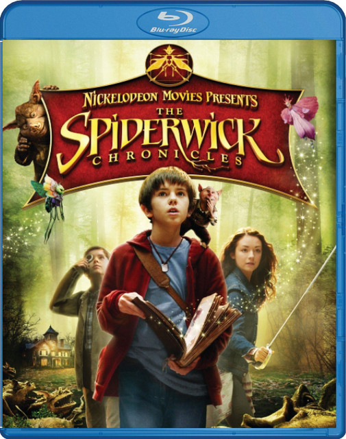
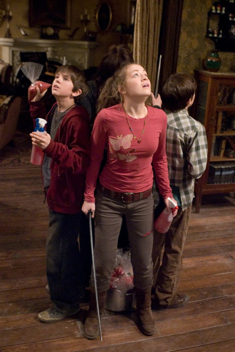

《奇幻精灵事件薄 The Spiderwick Chronicles》

			【夫妻影评】《奇幻精灵事件薄 The Spiderwick Chronicles》

老公的评论：
 
　　看完这个电影的第一感觉是《阿凡达》，影片中一些关于怪物、精灵等生命的设计真的和《阿凡达》有许多异曲同工的地方。
 

　　关于这类儿童题材的影片，我感觉作为大人看起来也很有意思，看这种有年龄或者文化差异的影片可能有两种结果，一种觉得非常无趣，完全理解不了，另一种则像这部电影，可以引起很多的共鸣。
 

　　我不知道别人是怎样的，至少在我小的时候幻想过很多的稀奇古怪的生灵都生活在我的周围，其中最让我向往的是孙悟空变得那个“前知五百年，中知五百年，后知五百年的”小人，我觉得那个小人真的很有意思。后来看《格列佛游记》，又幻想有个小人国的小人可以抓来圈养……
　

　自己的年纪已经不小了，但我却觉得我可以一直保持着一份天真的心灵，这种快乐的感觉不仅影响着我的生活，就是对工作其实也是很有帮助的。
 

　　我觉得作为成年人，看儿童片最重要的就是在影片中寻找那一份曾经，时光不会重来，但人的思绪却可以飘到有穷远的过去或者是无穷远的未来……
 

老婆的评论：
 

　　一个倔强的小孩杰瑞德，认为此次搬家都是因为妈妈对爸爸不好，所以，对于新家充满了排斥，无意中在这个老房子中，找到一本书，这本书让他们随后的生活发生了变化，当然，最终他懂的并不是妈妈把爸爸赶走的。
 
　　这样的故事，似乎在孩子的故事里，并不少见。
 

　　但我还是挺喜欢这个故事的，人的周围还活着一些我们看不见的东东，这个隐藏的世界，当你看到了，惊讶，害怕，你会接受再如何？而我的话，还是希望不要看见的好。
 
　　一堆小怪在围攻自己的房子，正是杰瑞德打开书的结果，杰瑞德与兄弟西蒙及姐姐玛洛丽，怎么办？这正是他们解决的。
 

　　其实故事的过程并不重要，结果也一定会是他们一定能战胜这些恶魔带领的小怪们。但这次电影中创造的爱喝蜂蜜的小精灵，爱吃鸟的小妖精霍格斯奎尔，及空气精灵这是比较吸引我的东东。
 
上映年份2008
 
主要演员Jared/Simon……Freddie
Highmore							
		
http://blog.sina.com.cn/s/blog_52187ba90100lmm1.html
