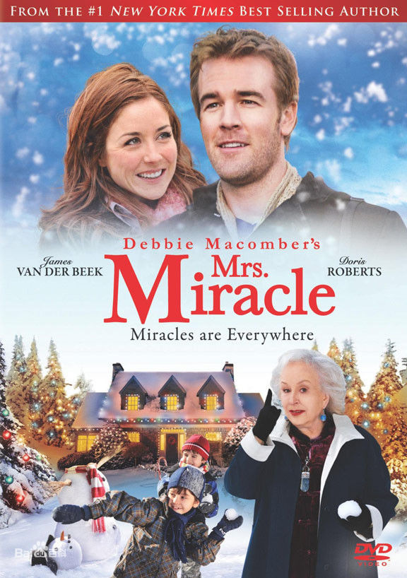

《奇迹太太 Mrs Miracle》

			

老公的评论：
 
　　一部典型的爱情喜剧，有恋爱、有家庭、有孩子，还是双胞胎……
 
　　这部电影给我的感觉是一直在不断地向屏幕前边的我散发着一种温馨的感觉，那种感觉很淡，但却是一种令人愉悦地包围。
 

　　故事的男主人公我们在《23号公寓的坏女孩里见过》，而女主角则是我们喜欢的《重回昨日》的埃丽卡了，说起来，《重回昨日》第三季以后有点不好看了。
 
　　围绕圣诞节的故事，是不是也就相当于西方人的“贺岁片儿”了，这部电影里讲述了亲情、爱情、原谅、宽容……，很不错。
 
老婆的评论：
 
　　我猜奇迹太太是赛斯的亡妻化身回来的，你猜呢？
 

　　这部电影其实很简单，讲述了困在走不出亡妻的感情中的赛斯，养育着两个淘气的双胞胎儿子，保姆一个个的换，他既当爸又妈的生活很是糟糕，连最喜欢的钢琴也不再谈了。而另一边是曾经被姐姐伤害过的丽芭，她也被困在那了。经过奇迹太太的穿针引线，他们互相发现对方，并一起解决了问题。应该会有一个幸福的未来吧！
 
　　额！这部简简单单的影片，却挺温馨，挺感人的。
 
　　这次这两个主人公我们都认识额！！
上映年份 2009							
		
http://blog.sina.com.cn/s/blog_52187ba9010183ik.html
