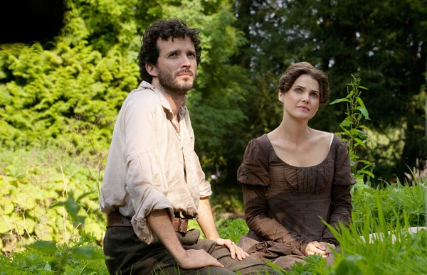

《奥斯汀乐园 Austenland》

			

老公的评论：
 
　　之前还和老婆大人探讨为什么当年的世界名著都没落了，就看了这么一部有关世界名著的电影，有趣。
 

　　因为小的时候没有那么多的书可以选择，所以奥斯汀的书我还是看过的，虽然时隔经年，记忆已经模糊了，但是我觉得从开始看的那天，我就没怎么对这些世界名著里的角色感兴趣过。不过，好在这部电影其实和奥斯汀不必非联系起来不可。
 

　　故事最经典的地方，在于组织者说本来就是安排马厩小子和女主有感情线发展的，这样的安排很经典，也让人有恍然大悟的感觉，虽然会为女主人公被涮了而感到一些不公平，但也不由得对编剧涌起了一些敬意。
 
　　至于最后去找女主的诺波利，觉得这个人物的样子真的很古典，但是显得老了一些。
 
　　不知道中国如果有这种金庸乐园、古龙乐园什么的，会不会有玩家去玩，这些玩家会不会遵守规则呢？

 
老婆的评论：
 
　　其实一部电影节奏这么慢，还能让我们看的很高兴，真是难得。
 
　　我蛮喜欢这部电影的。温馨，有创意！
 
　　这样一种体验旅游，我都心动了。
 

　　主人公珍妮非常喜欢英国女作家简奥斯汀的小说，小说已影响到她的感情生活，向往真爱的她决定去“奥斯汀庄园”度假，虽然她的钱只够基本套餐。
 

　　因为是基本套餐，她只能参加部分活动，她遇到了她以为的真爱——庄园的工作人员，可戏剧性的是这个角色也是演员，是指派来和她来谈恋爱的。这么一弄，当真正的爱情出现在她面前，她都不相信了。
 
　　还好他（J·J·菲尔德饰）够坚持，终于，珍妮找到了自己的真爱！
 
　　 J·J·菲尔德这个演员可以演非常忧郁的人。

上映年份 2013							
		
http://blog.sina.com.cn/s/blog_52187ba90101hs9x.html
