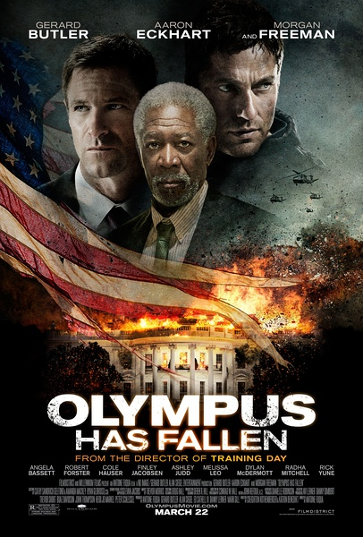
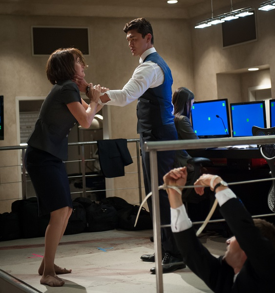

《奥林匹斯的陷落》

			

 
老公的评论：
 
　　在当今的电影界，巴特勒应该算是位“星儿”了，他出演的动作片还是有一定的保证的。
 

　　虽然看了介绍，但是我依旧没有想到这部电影居然如此火爆——白宫居然被恐怖分子攻陷了——这个话题不仅刺激、有趣，而且，哈哈，还有些解气的感觉，虽然不是只吃恐怖行动，但是看到一贯实施武力霸权的美国遭到这么大的打击，还是觉得挺解气的。
 

　　在电影中，恐怖分子的攻击效率很高，在救援部队还没有到达的时候，白宫已经被占领了，我只是有点不明白，明知道对手用的是重型武器，那些美国训练出来的经营探员们为什么在白宫门口和他们用手枪对射，直到被完全消灭？
 

　　巴特勒扮演了美国人最喜欢的孤胆英雄，这方面略有些脸谱化——这样的英雄人物必须本领高超，必须不拘小节，必须爱讲脏话，必须把官僚们不放在眼里，也必须犯过一些小过错而被人误会，好像在美国电影中，孤胆英雄们都要有一些“不按常理出牌”的做事风格。
 

　　在这部电影里，巴特勒和弗里曼不用说了，扮演总统的阿伦·艾克哈特，扮演福布斯的迪伦·麦克德莫特，扮演罗玛的科尔·豪瑟还有扮演恐怖分子首领的尹成植都是老熟人，看着挺有意思的。

　
老婆的评论：
 

　　没想到，这部电影这么的精彩，这是昨晚看完《风暴》觉得过瘾后，又一部这么很有暴力，很有破坏力的电影，所以在感观上很震撼，剧情也很有紧迫感。这是好电影才能做到的！
 
　　好吧，大概是，在这之前我们看了三部电影都很平静的电影，有点影响我对这部电影的评价。
 
　　其实像这种英雄式的人物是多少人的偶像，麦克太厉害，赶上史泰龙当年的《第一点血》，这就叫第一者生存。
 
　　更重要的是，我不得不承认美国的编剧真敢编，白宫就这么沦陷了？！行，有危机感。

                                   
熟脸孔给一张图，演过《暗警》

                              
右二是熟脸孔演过《追击》，给一张图
上映年份　2013							
		
http://blog.sina.com.cn/s/blog_52187ba90101fuqn.html
