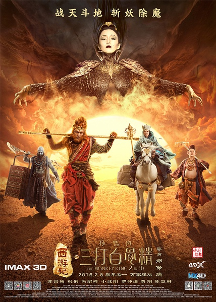
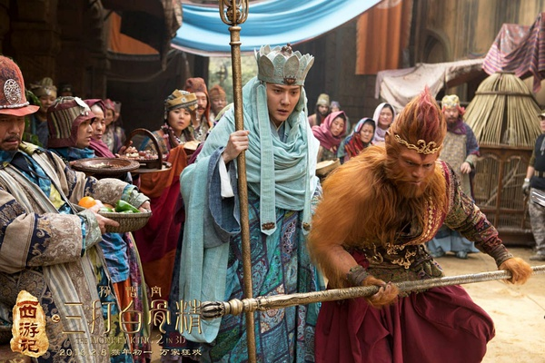
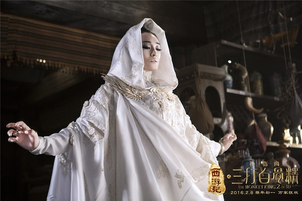

《孙悟空三打白骨精》

			

老公的评论：

　　虽然看完了这部电影，但是真的不知道该怎么评论！

　　我觉得这部电影的内容基本上和演员无关了吧？看特效不如去看动画片。另外，我其实也不怎么理解故事中塑造的那些形象到底都是什么意义？说搞笑又不搞笑，说哲理又不哲理，导演编剧不会觉得把一堆所谓的明星放在一起随便拍一下就叫电影吧？哈哈！

　　其实这部电影我最想看的演员是罗仲谦，还是很喜欢他在TVB剧集中的形象的，不过这次他扮演的蓝脸沙僧差点让我没敢认，挺有意思的，眼睛瞪的真大。

　　这部电影给印象最深刻的台词是八戒的那句“你多大岁数了，他才多大岁数……”，想想，这么说悟空，让他别和唐僧一般见识还真有道理！

　　让我觉得很贴心的是，这部电影中把悟空幻化成四个人跪拜唐僧的经典桥段给拍出来了，“三打白骨精”如果没有这个场景，就太失败了。虽然电影中的这个场景一点都不感人，但是导演编剧能想到这一点已经算是可以了。

　　只能算是一部看热闹的电影，对了，除了最后的大骷髅人，其他妖怪的造型还真不错！

老婆的评论：

　　己所不欲勿施于人，己所欲勿施于人，人所欲，请施之。这电影给我一个强烈的感觉，那就是唐僧（冯绍峰饰）很不地道也很自私，白骨精（巩俐饰）并不想投胎做凡人，他就用自己的意志，非要把白骨精送往人世间，他不让悟空（郭富城饰）打平民，而让打自己，一点都不考虑孙悟空的感受。

　　这样一部电影，在我看来动画制作的多，表演的少。

　　其实，我真心的觉得郭富城不适合演孙悟空，因为郭富城年龄偏大，动作也有些僵硬，怎么都没有六小龄童演的孙悟空的感觉。再一个，已经化妆成这样，是不是郭富城一点意义都没有。另外我也觉得白骨精是不是巩俐也没什么关系，反正她出场都由更绚的特效组成。

　　沙僧没想到是罗仲谦演的，真的看不出来。

上映年份 2016
							
		
http://blog.sina.com.cn/s/blog_52187ba90102wsyh.html
