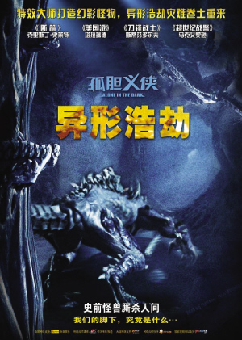
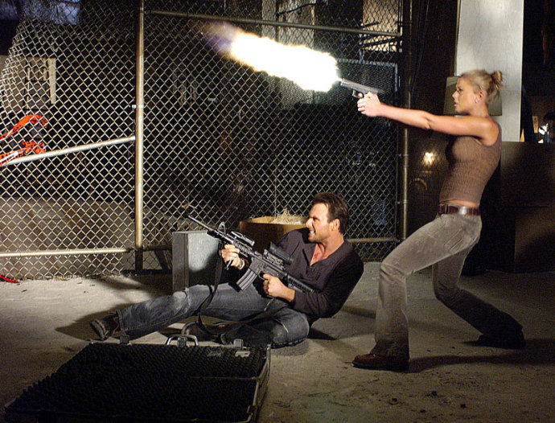

《孤胆义侠之异形浩劫 Alone in the Dark》

			

老公的评论：
 
　　看介绍挑的这部这部电影，从介绍中所说的“光明世界”和“黑暗世界”还以为这部电影是一部魔幻的，结果有点失望。
 

　　这部电影有点像是《异形》、《星际之门》、《DOOM》这类电影的合体，从内容来看，题材没什么问题，只是感觉电影在角色的塑造上很干瘪，好像很多背景都没有交代清楚，又好像有很多外延都没有表现出来。
 
　　最近还是更爱看连续剧一些，感觉上这部电影的题材要是能拍成连续剧，是不是和《V星入侵》有一拼？
 
　　一部没有给我留下什么深刻印象或者桥段的电影，可看可不看吧！

老婆的评论：
 
　　我觉得这部电影是一部挺好的催眠片，看着真的很没意思，我差点就睡着了，不过，幻想着后面还有点什么，就忍着看完了。
 

　　从剧情来看，这部电影感觉不完整，开始的奇怪结束的也奇怪，结尾部分才把象征着异形的门打开，那之前的异形怎么出来的？博士造出的20人是干什么用的？这些都是硬伤！

　
　　拍摄的感觉我也不太喜欢，太黑，人物形象塑造的也没有特别，主人公追查事件的结果就是看到了他们小时候被植入虫子的地方，打开一个怪物大门，那不追查岂不是更好。							
		
http://blog.sina.com.cn/s/blog_52187ba90101290x.html
