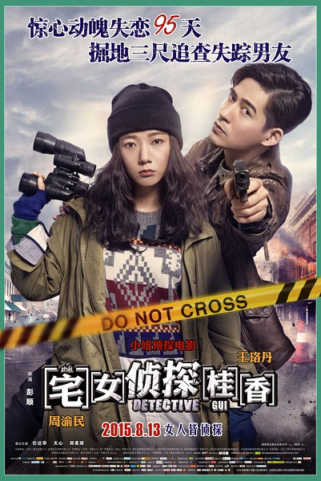
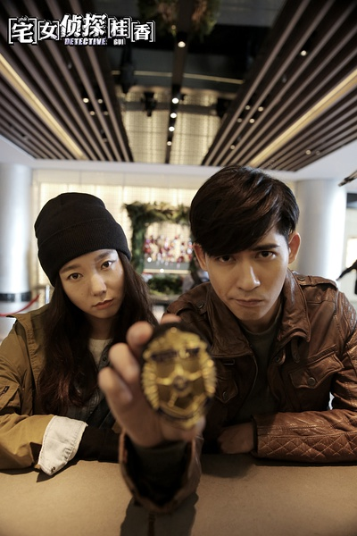
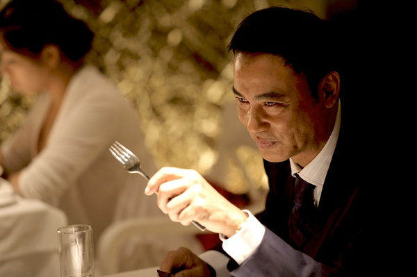

《宅女侦探桂香》

			

老公的评论：

　　对于年轻一点的演员，我都不大熟悉，所以这部片子中我比较熟悉的面孔是任达华、邵美琪还有因为《第八号当铺》知道的天心，两位主演王珞丹和周渝民我只是看着眼熟。

　　对于这部电影的第一体会是节奏太慢了，有些看不下去的感觉，似乎台湾地区的电影节奏都不是我能欣赏的；而第二体会则是周渝民怎么那么像梁朝伟，或者像陈宝国……，不会说现在的男艺人也都按照一个模子整容吧！第三体会则是任达华真的现在出演太多的电影了，哪里都有他的身影。

　　反倒是这部电影的情节没有什么好议论的，侦破电影嘛——我们姑且这么认为，太多剧透就不好看了，只是那个老太太怎么死得对我来说是个谜……

　　本想借一部侦探题材的电影提升一些对台湾电影的好感，结果还是失望了……

老婆的评论：

　　我觉得台湾电影给人感觉节奏太慢，慢得让我想睡觉。

　　桂香像不像《灵异妙探》里面得肖恩？有超强的观察力，她能从各种细微的差异中找到联系。

　　在看过那么多侦破类的美剧，我想在侦探方面，这部电影还真没有什么创新，可能要把这部电影当着爱情故事来看，两个主人公通过侦破一个案件，产生了感情。

　　还有一个整个电影，经常在黑暗中进行，我不太喜欢。

　　天心与印象的那个感觉不同了。任达华在最近看的电影里都有参合了一把，很奇怪额。

上映年份　2015
							
		
http://blog.sina.com.cn/s/blog_52187ba90102w4ju.html
