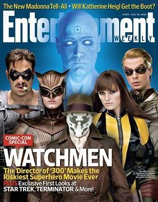
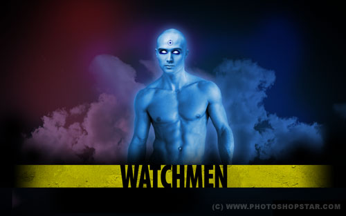
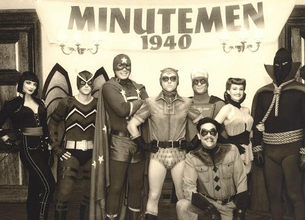

《守望者 WATCHMEN》

			【夫妻影评】《守望者 WATCHMEN》

老公的评论：
 
　　不得不说，这是一部介绍与影片本身反差很大的电影。
 

　　我是因为介绍才看这部电影的，在我的想法中，这部电影应该充满着高科技的制作效果，震撼人心的打斗场面以及出人意料的造型设计，结果，我很失望，真的很失望。
 

　　我觉得影片中好看的部分就是监狱里的打斗那一段，剩下的什么曼哈顿博士在火星什么的，真的没有什么特殊的，更不要说那个反派一号阿德里安的造型了，太简单了。
 

　　我觉得我以后很难再相信影片介绍或者海报中所说的了，看来还是相信大腕更靠谱一些，毕竟那些人爱惜羽毛，不会什么片子都接的。
 

　　兴奋的一点是在刚刚看完五季《邪恶力量》之后又看到了萨姆与迪恩的爸爸的扮演者，这次他扮演的小丑显得年轻了许多。再挑一个亮点的话，我觉得电影中那个会自动变幻图案的面具不错，如果真的市场上有卖，一定会旺销。
 

　　应该说这部电影的立足点还是很有可取之处的，就如同很多部《泰坦尼克》的拍摄才造就了经典大片《泰坦尼克》一样，希望《守望者》以后也会大投入重拍，剧情在激烈紧凑一点，绝对是部好看的电影。
 

 
老婆的评论：
 

　　又是漫画改编的电影，在众多影评好评声中，我们看了这部电影。如果用失望两个字的话似乎有点过，但绝没有09年不可错过的好莱坞电影的虚荣，错过并不可惜。
 

　　一群超级英雄在世界和平中退休了，本来可以安享晚年，但其中“Comedian”被杀死了，引起了其他英雄的注意，“蒙面人”Rorschach开始调查，“Nite-Owl”、Laurie、曼哈顿博士也开始关注这个事件。电影中出现的人物主要人物太多，导致每个人物都不能刻画的特别的生动，在众多主人公的情况下，我连这些英雄们的名字都记不清了。
 

　　故事证明了，并不是每一个英雄都能一直是英雄，总有人最后变节，导致晚节不保。Ozymandias就是那个变节的英雄，他试图控制全世界，又一直挑拨和打击他的强力对手曼哈顿博士，直至其飞到火星。他是最后的坏蛋，只是曼哈顿博士最后为什么要放过他？坏人不是都应该得到应有的惩罚？
 
　　《守望者》这个名字起的不错，不过，他们也只是守望美国而已，呵呵。
 
上映年份2009
 
导演Zack Snyder
 

主要演员Dan……Patrick
Wilson
Dr. Manhattan……Billy Crudup
Jupiter ……Malin ?kerman
Adrian……Matthew Goode　　
Rorschach……Jackie Earle Haley
The Comedian……Jeffrey Dean Morgan							
		
http://blog.sina.com.cn/s/blog_52187ba90100kd5k.html
