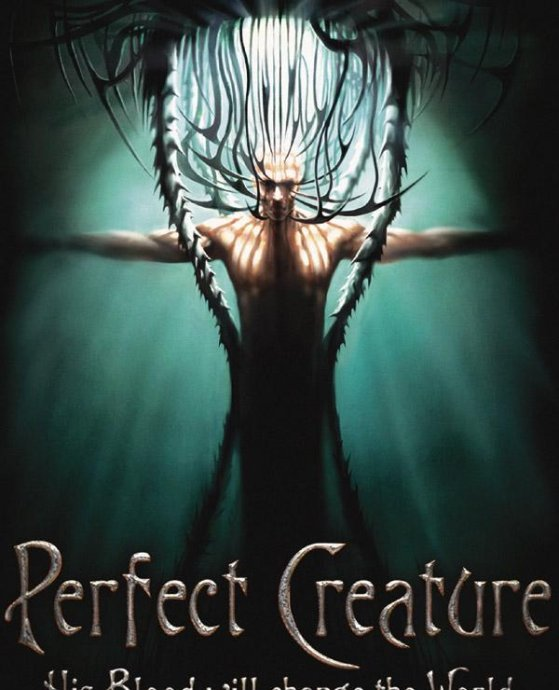
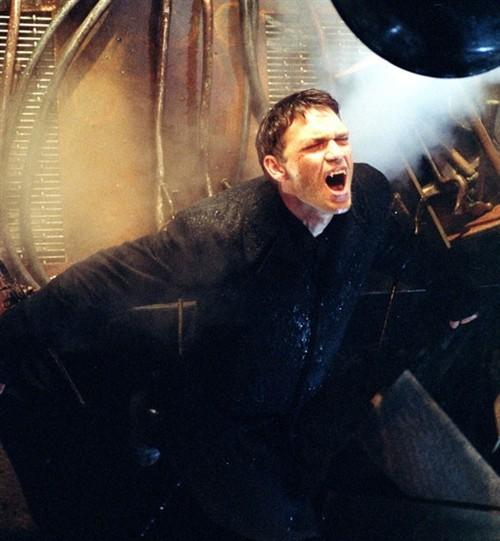
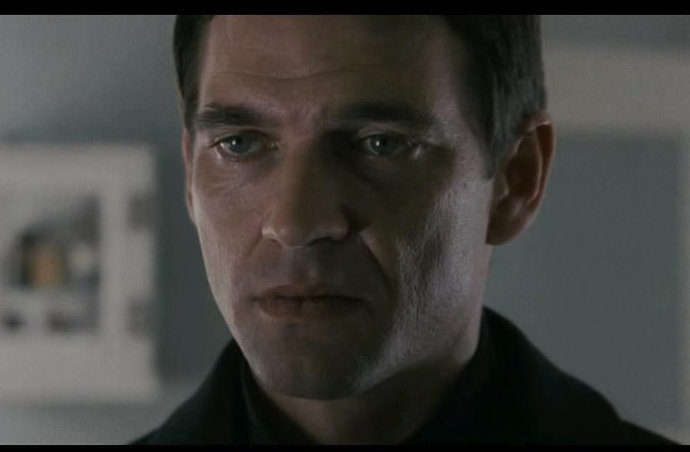
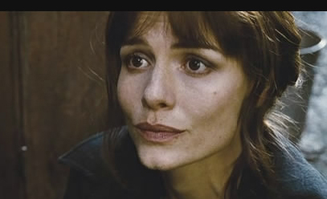

《完美生物 Perfect Creature》

			【夫妻影评】《完美生物 Perfect Creature》

 
老公的评论：
 
　　感觉这部电影很文艺，不是一个商业气息很浓的片子。
 

　　我所欣赏的，是电影中对于吸血鬼的特殊来历的描述——吸血鬼并不是什么怪物，而是人类为了对抗某项病毒而进化出来的新物种——这种解释很合理，也很有意思！正是因为这种理念的存在，让人类和吸血鬼可以在共同的世界里生活，而且没有矛盾，没有斗争。
 

　　感觉上这部电影虽然有些血腥，但看起来却和《暮光之城》有一些类似的地方——人可以和吸血鬼很平和地生活在一起，吸血鬼也并不都是坏蛋！
 

　　电影中的人类依旧是残忍的，为了控制病毒的蔓延而要彻底摧毁一个地区，这样的剧情已经在很多灾难片里出现过了，真可怕，但，或许也是更负责任吧，细想起来，如果非典流行的时候，北京处于电影中的世界里，真不知道会怎么样！说道非典，忽然想起了甲型流感，最近怎么也没人提了，是不在有人罹患这种疾病了吗？
 
　　全新的世界真的很怪异！
 

　　幻想着自己可以成为吸血鬼，可以长生不老，和老婆一起，游戏人间！那样的话，我就可以实现我的梦想之一——学会天下所有的语言了！
 

 
老婆的评论：
 

　　看我们博客的朋友一定知道，我和先生钟爱关于吸血鬼故事的影片。这部影片讲的就是吸血鬼的故事，虽然影片偏平淡一些，但还可以看。
 

　　不同与之前影片对吸血鬼的诠释，这部影片告知大家吸血鬼是人类基因突变而成的一种生物，对于吸血鬼的其他方面，我觉得同《真爱如血》电视剧中有相似之处，吸血鬼与人类是和平共存的。
 

　　不同的是这里的吸血鬼是服务于人类的，当吸血鬼Edgar袭击人类开始时，一切都变了，为了维护教会的名声，派Edgar的哥哥优秀的Silus去协助人类警察追捕Edgar……。在这一过程中爱情元素也随之出现了，Silus爱上了女警官，日后为了她，也被教会追杀，影片结尾部分Silus说该是他反击的时候，我想是为了拍续集吧。
 

　　这部影片的风格有的像宫崎骏的作品，时代感并不是很强，是在一个架空的空间，马车、汽车和飞艇共存，整部影片都在一个比较昏暗的场景中完成，适合吸血鬼。
 
上映年份 2006
 
部分演员职员表：Director……Glenn
Standring
导演……格伦·斯坦德林
Writer……Glenn Standring
编剧……格伦·斯坦德林
 

Silus……Dougray Scott
塞勒斯……杜加里·斯科特
 

Lilly……Saffron Burrows
莉莉……萨伏龙·布伦斯

Edgar……Leo Gregory
埃德加……里奥·格雷高里

　　
　　							
		
http://blog.sina.com.cn/s/blog_52187ba90100gkka.html
