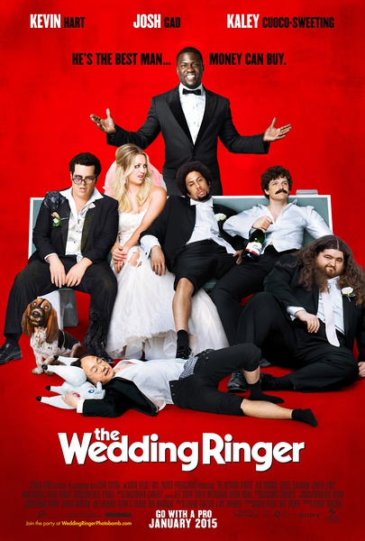
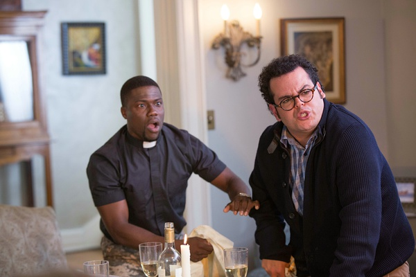
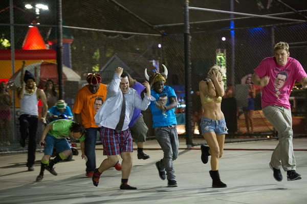

《定制伴郎 The Wedding Ringer；The Golden Tux》

			

老公的评论：

　　《佐州自救兄弟》我们没看下去，之前其他的片子印象不深刻，而《狱前教育》让我们见识了凯文·哈特的喜剧才华，这部《定制伴郎》，在我看来，比《狱前教育》要更喜剧一些，更积极一些。

　　查资料的时候看到凯文·哈特要和勒布朗·詹姆斯拍一部《篮球兄弟》，才知道他的个子真的很矮，但是我觉得明星就是明星，他在电影中的气场很强，虽然看得出他不是个高个子，但是比那些靠卖丑而优的演员强了太多。

　　在和身边的朋友聊天的时候，我一直劝他们一定要等自己学会了选择再结婚，很多后来的被人为失败的婚姻都是因为当事人还没有学会选择，就凑合着过了，这部片子里的新娘其实是那个“学会了选择”的人，而新郎则在最后知道了选择的意义，放弃了婚姻，虽然并没有太出人意料，但是很有感觉。

　　其实，我一直有一个创业梦想，就是做一家真正的婚礼策划公司，并且保证每个策划案都是独一无二的，绝对为新人策划只属于他们的婚礼，不知道这个梦还有没有机会实现——因为好像现在的婚庆公司都不是看独创性活着的，如果做一家这样的公司，估计会很累。

　　金色晚礼服套餐——真的挺酷的！

老婆的评论：

　　不得不说，我总能在欧美电影中，看到一些有意思的职业，定制伴郎，既然能单拿出来拍成一部电影，我想，这是一种特殊的需求。当然，这个世界总有很多正常人觉得很轻松的事情，有些人做起来就难。

　　这部电影很好看，相比之前凯文·哈特饰主演的《狱前教育》更轻松，少了很多脏话，属于老少皆宜的喜剧。

　　道格很腼腆没朋友，在即将来临的婚礼上他没有伴郎，找到了吉米寻求帮助，在这个过程中，他和吉米真的交上了朋友，而他也发现了，原来一直要结婚的准新娘心里并没有他，这也算是一种圆满，虽然没结成婚，也不需要遗憾，毕竟不够爱。

　　吉米找来的那几个伴郎，可真是歪瓜裂枣，看着怎么都别扭，可是，当他们进行了一系列的包装时，那些人的长相就显得不重要了，那一个个创造出来的故事，让这些人物生动，更让主角道格显得为人好，把婚礼推向了一个高潮。

　　即便最后道格没结成婚，也与吉米成好朋友，吉米也没忘了收费，我觉得这点老外做的就很好。

　　最近又有两部电影没看下去《贵族大盗》节奏太慢，变天我没看懂要演什么。《告密者》节奏也慢，而强森很娘没把他的特点发挥出来，显得没意思。

上映年份 2015							
		
http://blog.sina.com.cn/s/blog_52187ba90102vsrg.html
