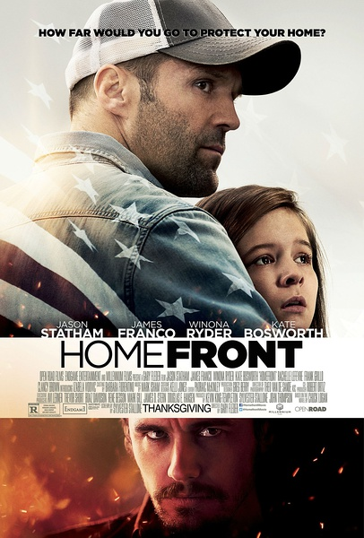
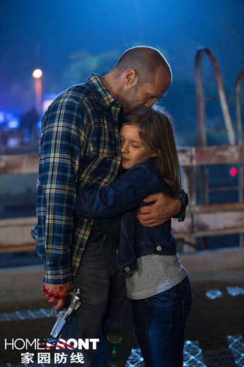

《家园防线 Home Front》

			

 
老公的评论：
 

　　印象里看斯坦森的上一部电影是《蜂鸟》，没看完，也就没有影评可写了，失望之余，这部《家园防线》总算让我看到了那个最爱的斯坦森。
 

　　虽然喜欢斯坦森，但是客观地说，这部电影可以算是那种没什么剧情的电影，总之就是孤胆英雄，一个人对抗一个或几个黑道组织，可能会受挫或被抓折磨一下，但是最终可以打败敌人。
 

　　看这部电影的时候，忽然反应过来在斯坦森扮演的角色当中，有温柔的笑脸的形象并不多见，有的大多是冷酷表情和冷酷的眼神，这就是角色的个性吧。
 
　　很多的电影明星扮演的角色都是有一些差异化的，但是斯坦森好像很“单一”，一直就是耍酷，哈哈，喜欢看他这个形象。
 
　　看《家园防线》这种电影很过瘾，还不用动脑子，其实是休闲的好快餐！

 
老婆的评论：
 
　　斯坦森是我很喜欢的一个演员，虽然长的不是很帅，但他主演的多部电影，我还是非常的喜欢。
 
　　布洛克（斯坦森饰）是一位卧底的警探，他在一次卧底行动后可能感觉不好，他离开了，回到妻子的老家生活。
 

　　他的女儿因为反抗了欺负她的男同学，而刚好男生的舅舅盖特是一个毒贩，他看到一些信息，将这些信息换对他有利的毒品销售渠道，引发了一系列的事情。
 
　　当然，盖特没想到布洛克这么强，不仅仅把派来杀他们的人给做掉了，还把他的毒品工厂也给炸了，甚至差点他也给杀了。

上映年份 2013							
		
http://blog.sina.com.cn/s/blog_52187ba90102v7w2.html
