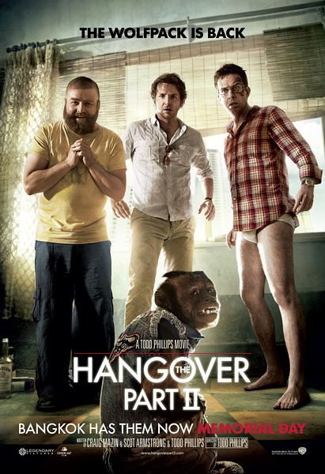
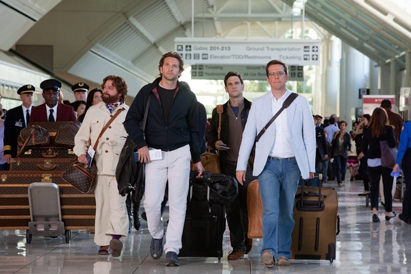

《宿醉2 The Hangover Part2》

			

老公的评论：

　　虽然并不是第一时间看的第一部，但是《宿醉》三部曲没有一起看，怕的是老婆大人犯懒，如果三部一起看，她很可能只写一个影评。

　　《宿醉2》给我最大的惊喜来自于“没有变化”！我本以外“单身Party”的题材可以用，但是细节还是要有大的变化的，结果编剧和导演偏偏要反其道而行之：依然是三兄弟耍宝；依然是艾伦下的药；偷老虎变成了偷老头儿；屋里的小孩儿换成了小猴子……，没有大的变化，但是依然可以看，依然笑的出来。

　　上一部的黑社会这次成了好基友，新的小舅子能够平和地对待自己切掉了自己的手指……，更多的角色加入进来总算是多了一些看点，反正是一部荒诞型的喜剧，再荒诞一点又何妨呢。

　　个人感觉上这种电影和老港片的贺岁片很像，看过、笑过，之后忘了也罢！

　　第三部会怎么拍呢？

老婆的评论：

　　如果说第一部带给我很多快乐的话，那这一部就少了很多，虽然我还是乐呵的看完这部电影，由于情节安排上的雷同，缺少变化让电影没有惊喜。

　　这次结婚的主人公是斯图，他要在泰国结婚，娶一位亚洲女孩，而新娘的弟弟泰迪是斯坦福的高材生，这让来参加他婚礼的艾伦非常的不爽，也是是因为破坏了他们的狼群，也是是因为对方非常的优秀，导致在结婚前夜，他又给大家下药了，再一次疯狂的夜晚。

　　艾伦是一位损友，这种神经质的人不管场合不管时间的自我一下，让大伙既刺激又悲惨，还会付出代价，是一位绝对被诅咒过的人，哈哈！

　　一部喜剧电影应该是老少皆宜的，可以携家带口的一起看，但这部电影，有的时候露的太多，用太低俗的镜头来提升电影，在某种意义上也是一种认怂，还有就是搞过了，在泰国他们的僧侣有很高的地位的，这部电影搞那个高僧，这是一种对文化的不尊重。可能，编剧没有这么多的想法，只是想在泰国人妖和僧侣都要拿来说说事，这个，让我有淡淡的失望。

　　最后时刻，斯图他们找到了泰迪，赶上了婚礼，到也算一种圆满。

上映年份 2011							
		
http://blog.sina.com.cn/s/blog_52187ba90102vpea.html
