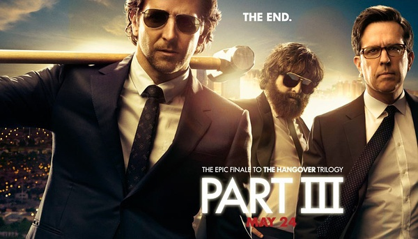
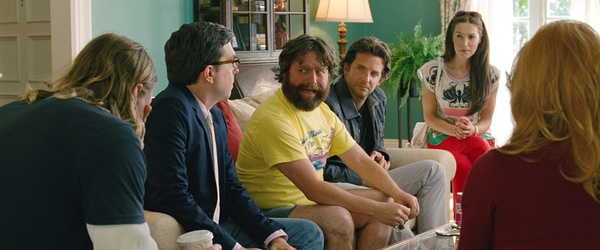
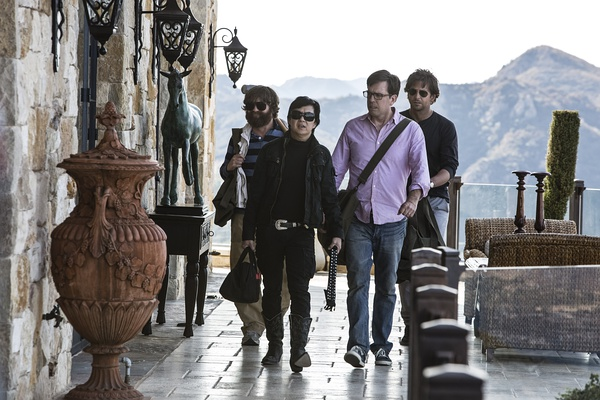

《宿醉3 The Hangover Part3》

			

老公的评论：

　　这一部虽然还是丢了道格，但是整个故事的风格改变了，从纯粹的玩儿乐搞笑变成了和黑帮做都肿的题材，我个人不是不喜欢罪案题材，但是我觉得《宿醉》系列应该保持自己的风貌，不该改变。

　　感觉上这部应该是系列的最后一部了，因为最能冷恶搞的艾伦都长大了、结婚了，他已经觉得自己应该“脱离狼群”而独立存活了，没有他，幼稚的损友戏怎么拍下去呢？

　　因为电影的风格改变，所以虽然演员还是那些演员，角色的性格也没有变化，但是整部戏给我的感觉不一样了，失去了那种“就等着看段子”的心情。

　　就到这里，结束吧，再拍估计就该看不下去了。

　　另外，不知道为什么，我很能理解艾伦对着小朋友时的感觉，无论是他认为小朋友应该叫卡洛斯，还是冒认自己是孩子的父亲，都挺能表现出艾伦的心理特点，这些细节做的很不错！

老婆的评论：
　　
　　结尾还不错，把电影拉回到之前两部的感觉里，艾伦结婚，几个人醒来又出各种状况，这次是周的杰作吧。

　　有艾伦那样的损友，我觉得真是菲尔、道格、斯图的不幸，相比道格有生命危险和斯图长了一对胸脯，菲尔好太多了。

　　艾伦和周的联系，给他们带来危险，道格被周的对头抓起来，威胁如果他们不帮他找回周偷走的黄金，那么就杀了道格，周又把他们骗了，说是为了道格去取回黄金，却是把对头的另一半给偷走了，还把艾伦、菲尔、斯图留下了，真可怜。

　　最后，周把对头给杀了，解决了问题，艾伦不是说不和周联系了吗？怎么结婚时周又来了？

上映年份 2014							
		
http://blog.sina.com.cn/s/blog_52187ba90102vpu2.html
